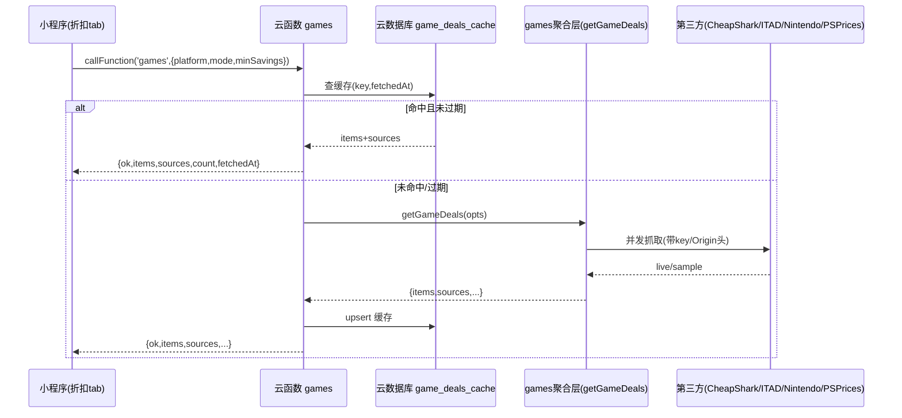
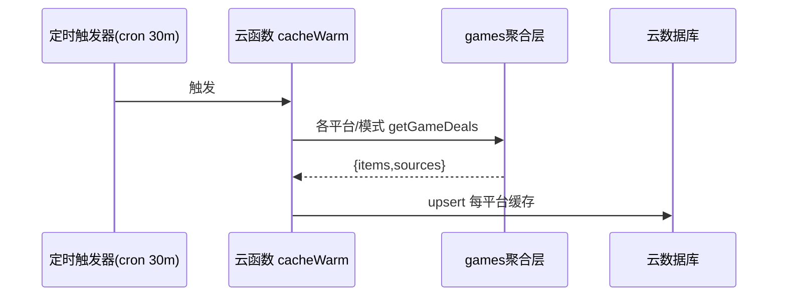
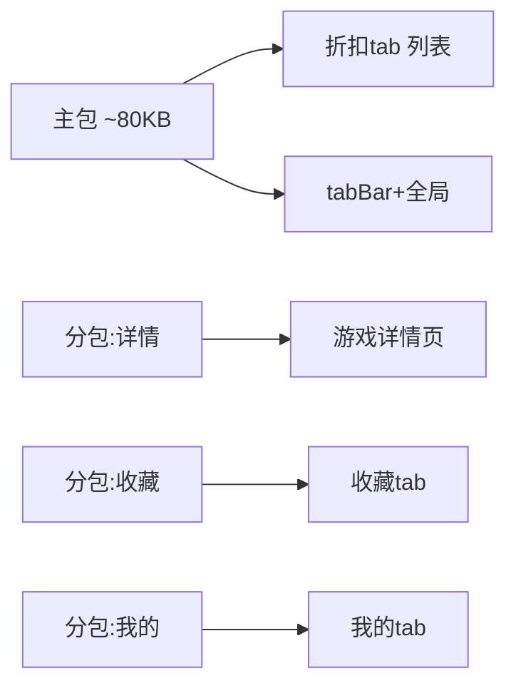

# Pulse 微信小程序版本 · 6 维方案设计交付报告

| 项 | 内容 |
|---|---|
| 项目简称 | miniprogram（Pulse → 微信小程序） |
| 交付日期 | 2026-07-17 |
| 交付类型 | 方案设计分析（**仅分析，未落地任何代码**） |
| 主理人 | 齐活林（Qi）· 交付总监 |
| 参与成员 | 许清楚（Xu）· 产品经理；高见远（Gao）· 架构师 |
| 工作流 | 部分工作流（仅分析：PM 功能取舍/导航/合规 + 架构师 BFF/微信能力/包体积 + 主理人汇编） |

---

## TL;DR

基于既有代码实测确认 **Pulse 的版本检测核心（依赖 winget/brew/注册表）无法上云**，因此 MVP 主推 **方案 B「围绕可整搬云的 games 优惠聚合、重建为独立轻量微信小程序」**；技术栈采用 **微信云开发（云函数 + 云数据库）**，**BFF 直接复用现有 CommonJS 聚合层（零改造）**，UI 全量重写为 WXML/WXSS；版本检测（方案 C 配对桌面端）DEFER 至 v2。

---

## 一、背景与硬约束（现状梳理结论）

本方案接续 2026-07-17 上午「小程序设计」session 的现状梳理，该 session 已基于代码实测锁定 3 个不可动摇的约束，作为本次一切分析的出发点：

1. **版本检测核心无法在小程序端或纯云端运行** — 检测逻辑位于 `src/detectors/*`（winget-show.js / brew-local-cask.js / brew-formulae.js 等，依赖 Windows winget、macOS brew 等 OS 原生能力），由 `src/workers/detect-worker.js` 编排。小程序逻辑层既不能访问本机文件系统/注册表/包管理器，也无法执行 brew/winget；更进一步，**连纯云端 BFF 都无法「扫用户本机」**——真正能采集本机应用状态的只有桌面端本身。
2. **附增模块与「即用即走」错位** — worldcup（世界杯）/ funds（基金）/ metalse（贵金属）/ ithome（IT之家）/ ai-sessions（AI 会话）/ ai-usage（AI 用量）/ reminders（提醒）/ search（搜索）/ summary（摘要）均为菜单栏常驻场景延伸，沉淀在桌面端，与小程序轻量定位不符。
3. **数据模型与微信体系不兼容** — 当前为本地文件 `config.json` / `state.json` + `safeStorage`（macOS Keychain / Windows DPAPI）；小程序是微信登录 + 云开发/云存储模型，鉴权与存储都需重做。

**关键可移植性事实**：`src/main/games/*` 游戏优惠聚合层（aggregator + steam/epic/itad/switch/psprices/sample + normalize）是**纯 Node HTTP 抓取 + 归一化**，无任何 OS 原生依赖，依赖 `.env` 的 API key 即可上云——这是小程序唯一能整搬的「真功能」。

---

## 二、6 维方案

### 2.1 产品定位（PM · 许清楚）

基于「版本检测无法上云、games 聚合可整搬云」事实，给出 3 个可行定位：

| 方案 | 描述 | 可行性 | 小程序契合度 | 成本 | 推荐 |
|---|---|---|---|---|---|
| A | 桌面端做传感器 + 云同步，小程序只「看」桌面扫出的更新状态 | 中高 | 低–中（依赖常驻桌面端，违背即用即走） | 中 | ✗ 作 v2 增值 |
| **B** | **小程序围绕可服务端化的 games 优惠重建为独立轻量产品，彻底放弃版本检测** | **高** | **高（即搜即看、可分享折扣）** | **低–中** | **✅ MVP 主推** |
| C | 混合：games 实时 + 版本检测「配对桌面端后拉取快照」 | 中 | 中（快照依赖配对，体验割裂） | 高 | ◐ v2 演进 |

**结论：MVP = 方案 B；版本检测（方案 C）DEFER 到 v2。**

### 2.2 功能取舍矩阵（PM · 许清楚）

评分三维：可移植性（能否服务端化）、小程序价值、契合度（即用即走）。

| 能力 | 可移植性 | 小程序价值 | 契合度 | 决策 | 理由 |
|---|---|---|---|---|---|
| 游戏优惠聚合（steam/epic/xbox/switch/ps） | 高 | 高 | 高 | **KEEP** | 唯一可整搬云、无 OS 依赖、API key 上云即可，最契合定位 |
| 应用版本检测（含桌面快照同步） | 低 | 高 | 低 | **DEFER** | 强依赖 OS 原生，必须经同机 BFF 或配对桌面端，MVP 难闭环 → v2 |
| 基金/贵金属行情 | 中 | 中 | 低 | **DROP** | 与轻量定位错位，行情涉资质 |
| 世界杯 | 中 | 低 | 低 | **DROP** | 时效热点，维护成本高 |
| IT之家资讯 | 中 | 中 | 低 | **DROP** | 资讯涉版权与「资讯类」资质红线 |
| AI 会话 / AI 用量 | 低–中 | 低 | 低 | **DROP** | 桌面本地 AI 配套，与小程序场景无关 |
| 提醒 / 搜索 / 摘要 | 低 | 低–中 | 低 | **DROP** | 依赖桌面常驻与本地状态，价值弱、成本高 |

**KEEP = 游戏优惠聚合；DEFER = 应用版本检测；DROP = 其余全部。**

### 2.3 页面导航（PM · 许清楚）

以 KEEP 的「游戏优惠聚合」为唯一核心，3 个 tabBar：

- **折扣（首页/发现）** — 默认进入，浏览全平台聚合折扣流；按 Steam/Epic/Xbox/Switch/PS 筛选、按折扣力度排序；点进单游戏看「历史低价 + 当前各商店比价」。
- **收藏** — 游客可用 `wx.setStorageSync` 本地收藏；登录后云同步；关注游戏降价时经订阅消息推送。
- **我的** — 微信登录、隐私政策与个人信息保护指引、《数据来源署名》、关于 Pulse；v2 版本检测「配对桌面端」入口也在此（顶部按钮，扫码配对）。

**登录态划分**：游客可看（折扣浏览 / 筛选 / 单游戏比价 / 本地收藏）；需登录（收藏云同步、降价提醒订阅、v2 快照拉取）。

### 2.4 BFF 架构（架构师 · 高见远）

**选型结论：推荐「微信云开发（云函数 + 云数据库）」而非自建 Node BFF。**

| 维度 | 微信云开发（推荐） | 自建 Node BFF |
|---|---|---|
| 开发成本 | 低，免运维 | 高，需部署/CI/监控 |
| 备案主体 | 后端跑腾讯云，小程序走微信认证，**免单独 ICP 备案** | 自有域名+国内服务器，**必须 ICP 备案** |
| 密钥管理 | 云函数「环境变量/密钥管理」注入 | 自建 .env/KMS，需自行防护 |
| 冷启动 | 有（秒级），缓存可规避 | 常驻无冷启动 |
| 第三方调用频率 | 定时触发器预热 + 云数据库缓存，降频明显 | Redis 更易控，但需自建 |
| open_id 获取 | 云函数内 `getWXContext().OPENID` 自动注入 | 需后端调 `jscode2session` 换码 |
| 聚合层复用度 | 高（同为 Node CJS） | 高（同为 Node CJS） |

**① 聚合层零改造搬移**：`src/main/games/*` 是 CommonJS，`module.exports = { getGameDeals }` 定点导出**原样可用**。迁移到 `cloudfunctions/gamesAggregator/games/`，云函数入口 `index.js` 做薄封装：`const { getGameDeals } = require('./games'); exports.main = async (event) => await getGameDeals(event);`。`.env` 密钥改为云函数环境变量（`ITAD_API_KEY` / `PSPRICES_API_KEY` 注入 `process.env`，去掉 Electron 的 `loadEnvItadKey` 文件读取逻辑）。

**② 跨域请求头在云端反而更简单**：ITAD 服务端请求天然带 `?key=`；PSPrices 同理带 key、无 key 回退 sample；**Nintendo Algolia 在 Electron 必须带 `Origin/Referer: https://www.nintendo.com` 否则 403，云函数可任意设请求头，该限制直接消失**。`sources[p]`（live/sample）由聚合层产生，BFF 原样透传给 UI 做「示例」徽标。

**③ 缓存策略（降第三方频率与成本）**：
- 缓存载体：云数据库集合 `game_deals_cache`
- 缓存键：`{platform}+{mode}+{minSavings}+{country}`
- 文档结构：`{ _id, items: GameDeal[], sources, count, fetchedAt, ttl }`（**sources 随缓存一起存**）
- TTL：30 分钟
- 预热（接口②）：云函数 `cacheWarm` 配定时触发器（cron 每 30 分钟）遍历平台/模式 upsert 缓存。用户请求几乎永远命中缓存，第三方调用从「N 用户→N 次」降到「每 30min 1 次」。
- 读取（接口①）：先查缓存，命中且未过期直接返回；未命中/过期才触发 live 抓取并回写。

**调用流（mermaid）**：

**④ v2 桌面传感器同步通道（仅预留形态，MVP 不做）**：桌面端 Pulse 定时把版本检测快照 POST 到云函数 `desktopSync.report`（携带配对码 + 快照 JSON），存入 `desktop_snapshots` 集合；小程序「我的」展示二维码 → 桌面端扫码 → `desktopSync.pair` 交换配对码并绑定 open_id；接口⑤ `desktopSync.snapshot` 按 open_id 取快照。**MVP 仅预留集合 schema 与云函数 stub，不实现。**

### 2.5 微信能力映射（架构师 · 高见远）

| 能力（微信 API） | 解决什么问题 | 用于哪个 tab / 场景 | 备注 |
|---|---|---|---|
| 微信登录 `wx.login` → code → 后端换 open_id | 用户身份，云同步/订阅/配对绑定 | 我的 tab | 云开发下云函数 `getWXContext().OPENID` 自动拿到 |
| 云数据库 | 收藏云同步、快照存储 | 收藏 tab / v2 我的 | 集合 `favorites`、`desktop_snapshots` |
| 云函数 | games 聚合 + 缓存预热 | 折扣 tab（接口①②③） | `wx.cloud.callFunction` |
| 订阅消息 `requestSubscribeMessage` + 下发 | 降价提醒推送 | 我的 tab / 详情页订阅 | 需用户授权；模板需 MP 后台申请 |
| 分享卡片 `onShareAppMessage` | 折扣/好价分享给好友群 | 折扣 tab / 详情页 | 卡片带游戏名+折扣价 |
| 云存储（可选） | 收藏缩略图/截图 | 收藏 tab | 存游戏封面，非必需 |

**游客态 vs 登录态边界（对齐 PM）**：游客态可看折扣流 + 本地收藏（`wx.setStorageSync`），不能云同步/订阅/v2 配对；登录态本地收藏与云端合并、可订阅降价提醒、v2 配对可用。**原则：浏览零门槛，身份相关能力必须登录。**

### 2.6 包体积与 UI 迁移（架构师 · 高见远）

**技术栈不可复用（关键结论）**：桌面 renderer（Preact + esbuild → renderer-dist）**不能直接复用**——小程序是 WXML/WXSS/JS 独立技术栈，必须重写。Apple 美学 / oklch / CSS 变量**设计 token 概念可复用，语法必须重写**：oklch 在部分 WXSS 环境不被支持 → 落地为 hex/rgb；px → rpx（750rpx = 屏宽）；focus-ring 在触屏无 `:focus` 语义 → 改为「对比度达标 + 最小点按区 88rpx + 语义 `role`/`aria-*`」落实 a11y 基线。

**体积估算（图片全走远程 CDN，不内置）**：
- 全局 `app.js/app.json/app.wxss/utils` ≈ 20KB
- 折扣 tab 列表 ≈ 30KB；详情页 ≈ 45KB；收藏 tab ≈ 30KB；我的 tab ≈ 30KB
- **合计代码 ≈ 155KB，远小于主包 2MB / 总包 20MB 上限**

**分包建议（保持首屏极简）**：

> MVP 体量其实可全放主包；但分包让首屏只下载折扣流，体验更优，且为 v2 扩展留结构，建议采用。

**UI 设计体系迁移要点**：styles.css 的 oklch token → WXSS `:root{--color-bg:#...;}` 变量（颜色函数转 hex/rgb）；设计 token（间距/圆角/字号档位）保留为 WXSS 变量保视觉一致；对比度以 WCAG AA 为基线，最小点按 88rpx，分享卡片图按微信规范 5:4。

---

## 三、接口契约（一句话）

- ① `云函数 games(platform,mode,minSavings,sort,country) -> {ok,platform,mode,items,sources,count,fetchedAt}`（聚合查询，sources 透传 live/sample）
- ② `定时触发器 cacheWarm(cron 30m) -> 各平台/模式 getGameDeals 并 upsert 云数据库 game_deals_cache`（缓存与定时刷新）
- ③ `云函数 favorites.sync(open_id, items) -> {merged, savedCount}`（收藏云同步，合并本地与云）
- ④ `云函数 priceAlert.subscribe(open_id, gameId, targetPrice) -> {subscribed}; 定时比对缓存价并下发订阅消息`（降价提醒订阅+推送）
- ⑤（v2）`云函数 desktopSync.pair(code)->{deviceId,bound}; desktopSync.snapshot(open_id)->{snapshot}`（桌面扫码配对 + 版本检测快照拉取）

---

## 四、主理人结论与落地路径（齐活林 · 交付总监）

**一句话结论：MVP 用微信云开发做「纯 games 优惠」小程序，BFF 直接复用现有聚合层（零改造），UI 全量重写，版本检测留给 v2。**

**建议排期（落地路径）**：
1. **先拍板合规与资质**（云开发 vs 自建、ITAD/PSPrices/Nintendo 商用授权、类目、隐私政策）
2. **BFF**：搬 games 聚合层 + 缓存预热（接口①②）
3. **小程序端**：3 tab 重写 + 游客/登录边界
4. **微信能力**：登录、订阅消息、分享卡片

---

## 五、落地前待拍板事项

| # | 事项 | 影响 |
|---|---|---|
| 1 | 云开发还是自建（备案主体） | 影响排期、成本、合规 |
| 2 | ITAD / PSPrices 商用授权是否覆盖小程序分发 | PSPrices 为 B2B 付费且强制页脚署名，需确认授权范围含小程序 |
| 3 | Nintendo Algolia 抓取 ToS | 服务端代抓任天堂价格合规，建议法务过目 |
| 4 | UI 重写人力/工期 | Preact renderer 不可复用，3 tab + 列表/详情/收藏/我的需全量重写 |
| 5 | v2 桌面配对是否真做 | ROI 与优先级未定，MVP 仅预留 |
| 6 | 订阅消息模板 | 需在 MP 后台申请订阅消息模板，字段/触发频率受平台限制 |
| 7 | 数据合规 | 隐私政策文本、open_id 存储与个保法合规、收藏数据跨境（若用境外云） |
| 8 | 小程序类目资质 | 价格比较/优惠聚合是否落入需特殊资质类目，影响审核与上线 |

---

## 六、交付状态与署名

- **交付状态**：方案分析完成（架构/功能取舍/页面导航/包体积/微信能力/合规 6 维齐备），**未落地任何代码**
- **测试通过率**：N/A（仅分析阶段）
- **已知问题数**：0（分析层面）
- **文件清单**：本报告为分析衍生文档，无源码变更。既有可复用代码锚点：`src/main/games/*`（`getGameDeals` 定点导出）、`src/detectors/*` + `src/workers/detect-worker.js`（版本检测，确认不可上云）
- **团队成员与产出**：
  - 许清楚（产品经理）：产品定位三方案、功能取舍矩阵、3-tab 页面导航、微信审核合规风险清单
  - 高见远（架构师）：BFF 云开发选型与零改造搬移、缓存预热策略、微信能力映射、包体积与分包、UI 迁移要点、接口契约
  - 齐活林（主理人）：约束复核、跨成员信息中转、6 维汇总与落地结论

> 本报告为「仅分析」产物，遵循用户要求未修改项目代码。如需进入实现，可走标准 SOP（PRD → 架构任务分解 → 工程师编码 → QA 测试）。
