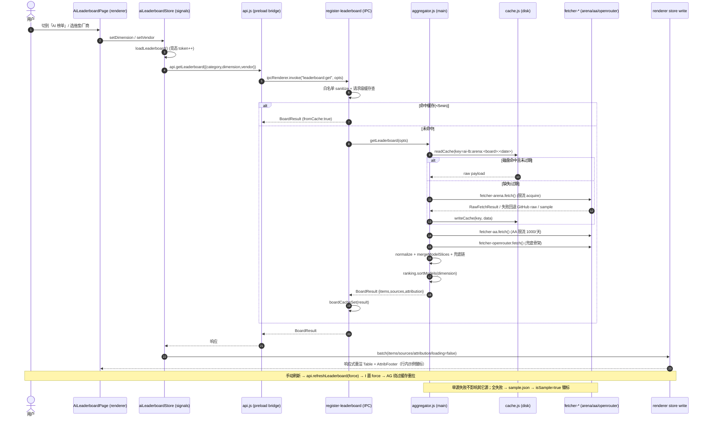
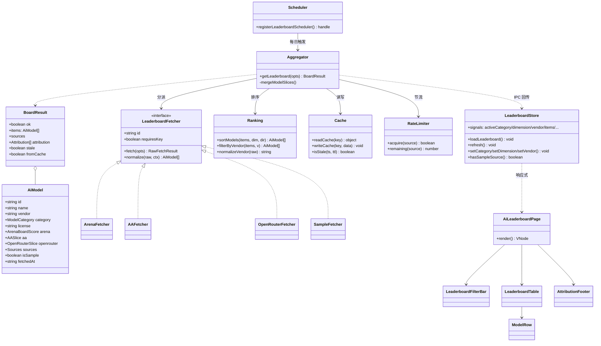

# AI 榜单排名模块 · 架构设计方案

> **设计人**：高见远（架构师）　**版本**：v1（架构基线）　**面向**：工程师可直接落地
> **一句话摘要**：沿用现有 Electron + Node CommonJS(main) + Preact/signals(renderer) 技术栈，按 games 模块的「多源 fetcher + aggregator + sample 兜底 + IPC 白名单」范式，构建**可插拔**的 AI 榜单模块——双主源（Arena 社区快照 + Artificial Analysis）归一化为统一 `AiModel`，主进程负责抓取/缓存/排名/IPC，渲染层只做多维度筛选与展示（vendor / 模型类型 / 评测维度），全链路 sample 兜底、永不空白、强制署名。

---

## 1. 实现方案与框架选型

| 维度 | 决策 | 理由 |
|---|---|---|
| **整体栈** | 沿用现有：Electron + Node CommonJS(main) + Preact + `@preact/signals`(renderer) + esbuild | 与 games 完全一致，零学习成本、零迁移风险 |
| **渲染层网络** | **禁止直连网络**，100% 走主进程 IPC 白名单（同 games） | 铁律；renderer 只调 `api.getLeaderboard()` |
| **main 模块形态** | `src/main/ai-leaderboard/*.js` 全部 CommonJS（`require`/`module.exports`） | 工程约定 `.js` 默认 CommonJS |
| **renderer 模块形态** | `src/renderer/ai-leaderboard/*.{js,jsx}` 全部 ES Module（`import`/`export`） | 工程约定 renderer 用 ESM + JSX |
| **新增 npm 依赖** | **0 个**（详见 §11） | Electron 39（Node 18+）内置 `fetch`(undici)；缓存/限流/调度均手搓（与 games 同构） |
| **架构模式** | 可插拔 fetcher + normalizer + aggregator（照搬 games 的 live/sample 源模式） | 新增数据源 = 注册一对 fetcher+normalizer；新增维度 = 扩 schema 字段 + UI 筛选项 |
| **缓存** | 磁盘缓存（userData 下 `ai-leaderboard-cache/`）+ 进程内 Map TTL | 离线可用、节流、单源失败回退 stale |
| **UI 令牌** | 复用 `styles.css :root` 令牌 + `oklch()`/`var()`，禁裸 hex，数字 `tabular-nums` | 满足 a11y 基线、Apple 美学 |

**三层职责总览**：

```
┌─────────────────────────────────────────────────────────────┐
│ 渲染层 (renderer/preact)  —  只展示、只发 IPC、不碰网络         │
│   AiLeaderboardLayout → Page → FilterBar + Table + AttribFooter│
│   aiLeaderboardStore (signals) ──api.getLeaderboard()──┐      │
└────────────────────────────────────────────────────────┼──────┘
                                                          │ IPC (白名单)
┌─────────────────────────────────────────────────────────▼─────┐
│ 主进程 (main/commonjs)                                          │
│  ┌─ 数据层 ─────────────┐  ┌─ 服务层 ───────────────────────┐  │
│  │ fetcher-arena.js     │  │ aggregator.js (合并/兜底编排)    │  │
│  │ fetcher-aa.js        │→ │ ranking.js (排序/筛选纯函数)     │  │
│  │ fetcher-openrouter   │  │ cache.js (磁盘 TTL)             │  │
│  │ fetcher-sample.js    │  │ rate-limiter.js (AA 1000/天)     │  │
│  │ normalize.js         │  │ scheduler.js (每日同步)          │  │
│  │ cache.js             │  └──────────────┬───────────────────┘  │
│  └──────────────────────┘                │                      │
│        register-leaderboard.js (IPC 契约) ←┘                      │
└─────────────────────────────────────────────────────────────────┘
```

---

## 2. 文件清单（标注 新增 / 改动）

### 2.1 主进程（CommonJS，新增）

| 文件 | 职责 |
|---|---|
| `src/main/ai-leaderboard/types.js` | 模块级常量：`SOURCE`、`CATEGORY_META`、`DIMENSION_META`、`VENDOR_META`、`ATTRIBUTION`、缓存键 helper、`slugifyVendor()`、`toAiModel()` 基础构造、JSON schema 引用 |
| `src/main/ai-leaderboard/normalize.js` | 共享 `fetchJson()`（UA+超时+abort）、`slugifyModel()`、`mergeModelSlices()` 合并策略 |
| `src/main/ai-leaderboard/fetcher-arena.js` | **主源1**：Arena 社区快照（text/code/vision/text-to-image/video 多 board），免鉴权；失败回退 GitHub raw |
| `src/main/ai-leaderboard/fetcher-aa.js` | **主源2**：Artificial Analysis（客观分+价格+速度），`x-api-key`；限流 1000/天；失败回退 GitHub raw |
| `src/main/ai-leaderboard/fetcher-openrouter.js` | **兜底L1**：OpenRouter `/api/v1/models`（实时目录骨架，非排名） |
| `src/main/ai-leaderboard/sample.js` | **兜底L2**：内置 sample 加载器（调 `toAiModel` 标 `source:'sample'`） |
| `src/main/ai-leaderboard/sample.json` | 随包内置最近一次 Arena+AA 快照（UI 标「示例」徽标） |
| `src/main/ai-leaderboard/cache.js` | 磁盘缓存：`readCache/writeCache` + TTL；命名空间 `ai-lb:<source>:<board>:<date>`；失败回退 stale |
| `src/main/ai-leaderboard/rate-limiter.js` | 令牌桶：`AA_LIMITER`（1000/天按 UTC 日重置）+ 通用并发/频率限制 |
| `src/main/ai-leaderboard/aggregator.js` | **聚合入口** `getLeaderboard(opts)`：分派 fetcher → 合并 → 兜底链 → 返回 `BoardResult` |
| `src/main/ai-leaderboard/ranking.js` | 纯函数：按 (category, dimension) 排序、按 vendor 筛选、minScore 过滤、vendor 归一 |
| `src/main/ai-leaderboard/scheduler.js` | 主进程每日同步调度（封装 `setManagedInterval`）+ `triggerSync()` |
| `src/main/ai-leaderboard/index.js` | 模块出口：`getLeaderboard` / `registerLeaderboardScheduler` / `triggerLeaderboardSync` |

### 2.2 主进程（改动）

| 文件 | 改动点 |
|---|---|
| `src/main/ipc/register-leaderboard.js` | **新增文件**：注册 `leaderboard:get` / `leaderboard:refresh` IPC handler（缓存命中→聚合→署名附带） |
| `src/main/ipc/index.js` | `require` 并调用 `registerLeaderboardHandlers(ctx)`（参照 `registerGamesHandlers` 一行） |
| `src/main/bootstrap/schedulers.js` | 在启动期注册 `registerLeaderboardScheduler()`（每日拉取，graceful） |

### 2.3 渲染层（ESM，新增）

| 文件 | 职责 |
|---|---|
| `src/renderer/ai-leaderboard/types.js` | 渲染端纯类型 + 默认值（对齐 games/types.js 单一真源） |
| `src/renderer/ai-leaderboard/format.js` | 数字格式化（`tabular-nums` 友好：分数/百分比/价格 $/1M/速度） |
| `src/renderer/ai-leaderboard/aiLeaderboardStore.js` | signals 状态 + `loadLeaderboard()` + 竞态 token + localStorage 视图偏好 + 署名/示例判定 |
| `src/renderer/ai-leaderboard/AiLeaderboardLayout.jsx` | nav panel 容器（mount→load + 监听刷新事件，unmount 清理） |
| `src/renderer/ai-leaderboard/AiLeaderboardPage.jsx` | 主页面：组合 FilterBar + Table + AttributionFooter + 状态态 |
| `src/renderer/ai-leaderboard/LeaderboardFilterBar.jsx` | 分类 tab（LLM/多模态/图像/代码/视频）+ 维度下拉 + vendor 筛选 + 搜索 + 刷新按钮 |
| `src/renderer/ai-leaderboard/LeaderboardTable.jsx` | 多维度表格（列随维度动态；`tabular-nums`） |
| `src/renderer/ai-leaderboard/ModelRow.jsx` | 单行/卡片（排名、名称、vendor 徽标、分数、价格/速度、来源态） |
| `src/renderer/ai-leaderboard/AttributionFooter.jsx` | 来源署名脚注（AA 强制 `https://artificialanalysis.ai/`、Arena MIT+来源） |
| `src/renderer/ai-leaderboard/states.jsx` | 加载骨架 / 错误 / 空 / 全 sample 四态 |
| `src/renderer/ai-leaderboard/ai-leaderboard.css` | 样式（**全部引用令牌**，禁裸 hex） |

### 2.4 渲染层（改动）

| 文件 | 改动点 |
|---|---|
| `src/renderer/api.js` | `createApi()` 增加 `getLeaderboard` / `refreshLeaderboard`（pick `window.api`） |
| `preload.js` | `contextBridge.exposeInMainWorld("api", {...})` 增加 `getLeaderboard` / `refreshLeaderboard` |
| `src/renderer/components/SideNav.jsx` | `navItems` 增加 `{ key:'ai-leaderboard', label:'AI 榜单', tooltip:'大模型排名 / 性价比 / 速度' }` |
| `src/renderer/components/LazyNavPanel.jsx` | 增加 `ai-leaderboard: () => import('../ai-leaderboard/AiLeaderboardLayout.jsx')` |
| `.env` | 新增 `ARTIFICIAL_ANALYSIS_API_KEY=`（无则 AA 维度回退；不阻断启动） |

---

## 3. 数据来源与角色

| 数据源 | 角色 | 鉴权 | Key 来源 | 频率 | 返回内容 | 兜底去向 |
|---|---|---|---|---|---|---|
| **Arena AI 社区快照** `api.wulong.dev/.../leaderboard?name=<board>` | **主源1**（社区 ELO） | 免鉴权 | — | 每日 + 手动 | `{meta, models:[{rank,model,vendor,license,score,ci,votes}]}` | GitHub raw 指针→具体榜 |
| **Artificial Analysis** `artificialanalysis.ai/api/v2/data/llms/models` | **主源2**（客观分+价格+速度） | `x-api-key`（免费，1000/天，**强制署名**） | `.env:ARTIFICIAL_ANALYSIS_API_KEY` | 每日 + 手动（严格节流） | `{data:[{id,name,slug,model_creator,evaluations{...},pricing{...},med_speed}]}` | GitHub raw `oolong-tea-2026/artificial-analysis-leaderboards` |
| **OpenRouter** `openrouter.ai/api/v1/models` | **兜底L1**（目录骨架，非排名） | 免鉴权 | — | 实时 | `{data:[{id,name,description,context_length,pricing,architecture,top_provider}]}` | → sample |
| **内置 sample.json** | **兜底L2**（永不空白） | — | 随包 | — | 最近快照 | 终态，UI 标「示例」 |
| OpenCompass 司南 / LiveBench | （可选增强，**默认关**） | 需爬取 | — | — | 爬取风险高 | 不纳入首期 |
| Papers With Code（已关停）/ HF Open LLM LB（冻结） | 仅历史补充 | — | — | — | — | 不纳入首期 |

**兜底链语义**（单源失败不影响其它源，全失败回退 sample）：
```
Arena(某 board) 失败 → GitHub raw Arena → 该 board 留空（其余源数据保留）
AA 失败           → GitHub raw AA     → aa 维度标 'none'（Arena 数据仍展示）
Arena + AA 全失败 → OpenRouter 目录    → 仅骨架（无分数）
全失败            → sample.json        → source:'sample' 徽标
```

---

## 4. 统一数据模型 `AiModel`（归一化 Schema）

融合 **Arena ELO** + **AA 客观分/价格/速度** + **OpenRouter 目录**，单一结构供渲染层消费。

### 4.1 TypeScript 风格类型定义

```ts
/** 数据来源标记（同 games 的 'live'/'sample' 语义） */
type DataSource = "live" | "sample" | "none";

/** 模型大类（驱动分类 tab 与 Arena board 映射） */
type ModelCategory = "llm" | "multimodal" | "image" | "code" | "video";

/** 渲染层可排序的评测维度 */
type RankDimension =
  | "elo"          // 综合能力（Arena ELO，按 category 选 board）
  | "intelligence" // AA Intelligence Index
  | "coding"       // AA Coding Index
  | "math"         // AA Math Index
  | "reasoning"    // 推理（GPQA/HLE 综合代理）
  | "price_perf";  // 性价比（intelligence / blended price）

/** Arena 某一 board 的归一化成绩 */
interface ArenaBoardScore {
  rank: number;     // 1-based
  score: number;    // ELO 风格分数
  ci: number;       // 置信区间半宽
  votes: number;
}

/** Artificial Analysis 客观指标切片 */
interface AASlice {
  intelligenceIndex: number;     // 0-100+
  codingIndex: number;
  mathIndex: number;
  mmluPro: number;               // 0-100
  gpqa: number;
  hle: number;
  liveCodeBench: number;
  priceInputPer1M: number;       // USD / 1M tokens
  priceOutputPer1M: number;
  priceBlendedPer1M: number;
  outputTokensPerSec: number;    // 速度
  timeToFirstTokenSec: number;
}

/** OpenRouter 目录骨架切片（兜底用） */
interface OpenRouterSlice {
  contextLength: number;
  description?: string;
  architecture?: string;
  topProvider?: string;
}

/** 统一模型结构 —— 渲染层只认这一种 */
interface AiModel {
  id: string;                 // 稳定主键：slugify(vendor + name)
  name: string;               // 展示名（如 "GPT-4o"）
  vendor: string;             // 归一化 vendor（见 VENDOR_META）
  vendorRaw?: string;         // 原始 vendor 字符串
  category: ModelCategory;
  license?: string;          // 许可（Arena 提供）
  arena: Partial<Record<"text" | "vision" | "code" | "image" | "video", ArenaBoardScore>>;
  aa?: AASlice;
  openrouter?: OpenRouterSlice;
  /** 各上游切片可用性（驱动逐字段「示例」/「暂无」标记） */
  sources: {
    arena: DataSource;        // 'live' | 'sample' | 'none'
    aa: DataSource;
    openrouter: DataSource;
  };
  /** 排名关键字段是否整体来自 sample（决定页头「示例」徽标） */
  isSample: boolean;
  fetchedAt?: string;         // ISO8601
}

/** IPC 返回的整体结果（对齐 games 的 getGameDeals 形状） */
interface BoardResult {
  ok: boolean;
  category: ModelCategory | "all";
  dimension: RankDimension;
  vendor: string | "all";
  items: AiModel[];
  /** 逐上游源标记（页头/脚注用） */
  sources: { arena: DataSource; aa: DataSource; openrouter: DataSource };
  /** 署名清单（脚注渲染，AA 强制） */
  attribution: Attribution[];
  count: number;
  stale: boolean;             // 命中过期缓存（网络失败）
  fromCache: boolean;
  fetchedAt: string;
  error?: string;
}

interface Attribution {
  id: "artificial-analysis" | "arena-snapshot" | "openrouter" | "sample";
  text: string;               // 展示文案（含强制链接）
  required: boolean;          // AA=true 强制展示
}
```

### 4.2 JSON Schema（主进程校验 / 渲染层契约）

```json
{
  "$schema": "http://json-schema.org/draft-07/schema#",
  "title": "AiModel",
  "type": "object",
  "required": ["id", "name", "vendor", "category", "sources", "isSample"],
  "properties": {
    "id":   { "type": "string" },
    "name": { "type": "string" },
    "vendor": { "type": "string" },
    "vendorRaw": { "type": ["string", "null"] },
    "category": { "enum": ["llm", "multimodal", "image", "code", "video"] },
    "license": { "type": ["string", "null"] },
    "arena": {
      "type": "object",
      "properties": {
        "text":   { "$ref": "#/$defs/board" },
        "vision": { "$ref": "#/$defs/board" },
        "code":   { "$ref": "#/$defs/board" },
        "image":  { "$ref": "#/$defs/board" },
        "video":  { "$ref": "#/$defs/board" }
      }
    },
    "aa": { "anyOf": [ { "$ref": "#/$defs/aa" }, { "type": "null" } ] },
    "openrouter": { "anyOf": [ { "$ref": "#/$defs/or" }, { "type": "null" } ] },
    "sources": {
      "type": "object",
      "required": ["arena", "aa", "openrouter"],
      "properties": {
        "arena":      { "$ref": "#/$defs/src" },
        "aa":         { "$ref": "#/$defs/src" },
        "openrouter": { "$ref": "#/$defs/src" }
      }
    },
    "isSample": { "type": "boolean" },
    "fetchedAt": { "type": ["string", "null"] }
  },
  "$defs": {
    "src": { "enum": ["live", "sample", "none"] },
    "board": {
      "type": "object",
      "required": ["rank", "score", "ci", "votes"],
      "properties": {
        "rank":  { "type": "number" },
        "score": { "type": "number" },
        "ci":    { "type": "number" },
        "votes": { "type": "number" }
      }
    },
    "aa": {
      "type": "object",
      "required": ["intelligenceIndex", "priceBlendedPer1M"],
      "properties": {
        "intelligenceIndex":   { "type": "number" },
        "codingIndex":         { "type": "number" },
        "mathIndex":           { "type": "number" },
        "mmluPro":             { "type": "number" },
        "gpqa":                { "type": "number" },
        "hle":                 { "type": "number" },
        "liveCodeBench":       { "type": "number" },
        "priceInputPer1M":     { "type": "number" },
        "priceOutputPer1M":    { "type": "number" },
        "priceBlendedPer1M":   { "type": "number" },
        "outputTokensPerSec":  { "type": "number" },
        "timeToFirstTokenSec": { "type": "number" }
      }
    },
    "or": {
      "type": "object",
      "required": ["contextLength"],
      "properties": {
        "contextLength": { "type": "number" },
        "description":   { "type": ["string", "null"] },
        "architecture":  { "type": ["string", "null"] },
        "topProvider":   { "type": ["string", "null"] }
      }
    }
  }
}
```

---

## 5. 数据结构与接口定义

### 5.1 Fetcher 接口（可插拔契约）

每个数据源 = 一个 `LeaderboardFetcher` 实现。新增数据源只需实现此接口并在 `aggregator.js` 注册。

```ts
interface FetchOpts {
  board?: "text" | "vision" | "code" | "image" | "video"; // Arena 用
  date?: string;        // YYYY-MM-DD（快照日期，默认最新）
  force?: boolean;      // 跳过缓存
}

interface RawFetchResult {
  ok: boolean;
  source: "arena-snapshot" | "artificial-analysis" | "openrouter" | "sample";
  data: unknown;        // 各源原始 payload
  fetchedAt: string;
}

interface LeaderboardFetcher {
  id: string;                       // 'arena-snapshot' | 'artificial-analysis' | 'openrouter' | 'sample'
  label: string;                    // 署名展示用
  requiresKey: boolean;             // AA=true
  /** 取原始 payload；失败返回 {ok:false}，绝不抛（aggregator 兜底） */
  fetch(opts: FetchOpts): Promise<RawFetchResult>;
  /** 把原始 payload 归一化为 AiModel[]（仅填自己知道的切片，缺失留 undefined） */
  normalize(raw: unknown, ctx: { board?: string }): AiModel[];
}
```

### 5.2 Aggregator 接口（服务层入口）

```ts
interface GetLeaderboardOpts {
  category?: ModelCategory | "all";   // 决定 Arena board 映射
  dimension?: RankDimension;           // 决定默认排序列
  vendor?: string | "all";            // vendor 过滤
  sortDir?: "asc" | "desc";           // 默认 desc
  search?: string;                    // 本地标题搜索
  force?: boolean;                    // 绕过缓存（手动刷新）
}

// src/main/ai-leaderboard/aggregator.js
function getLeaderboard(opts: GetLeaderboardOpts): Promise<BoardResult>;
```

**合并策略**（`normalize.js: mergeModelSlices`）：
- 主键 = `slugifyModel(vendor, name)`；
- 各 fetcher 的 `normalize()` 只填自身切片（arena / aa / openrouter）；
- `aggregator` 按主键合并多源切片为单个 `AiModel`；缺失切片保持 `undefined`；
- `sources.<slice>` = 该切片是否 live/sample/none；`isSample` = 排名关键切片（arena 或 aa，依 dimension）全为 sample。

### 5.3 服务层辅助接口

```ts
// ranking.js —— 纯函数，便于单测
function sortModels(items: AiModel[], dimension: RankDimension, dir: "asc"|"desc"): AiModel[];
function filterByVendor(items: AiModel[], vendor: string | "all"): AiModel[];
function filterBySearch(items: AiModel[], q: string): AiModel[];
function normalizeVendor(raw: string): string;   // → VENDOR_META key

// cache.js
function cacheKey(source: string, board: string, date: string): string; // 'ai-lb:<source>:<board>:<date>'
function readCache(key: string): { data: unknown; fetchedAt: number } | null;
function writeCache(key: string, data: unknown): void;
function isStale(fetchedAt: number, ttlMs: number): boolean;

// rate-limiter.js
function acquire(source: "artificial-analysis" | "arena-snapshot"): boolean; // 令牌桶，AA 1000/天
function remaining(source: string): number;

// scheduler.js（main）
function registerLeaderboardScheduler(): { start(): void; stop(): void; triggerNow(): Promise<void> };
```

### 5.4 IPC 通道契约

| Channel | 方向 | Request payload | Response (`BoardResult`) |
|---|---|---|---|
| `leaderboard:get` | renderer→main | `GetLeaderboardOpts` | 命中缓存/聚合结果（附 `fromCache`/`stale`） |
| `leaderboard:refresh` | renderer→main | `GetLeaderboardOpts`（`force:true`） | 强制网络重拉，清缓存后回写 |

> 渲染层**只**通过这两个通道交互；white-list 注册在 `register-leaderboard.js`。请求级缓存（同 games：`Map` + TTL 5min）在 IPC handler 内，避免重复打外部 API。

```js
// register-leaderboard.js 骨架（CommonJS）
safeHandle("leaderboard:get", async (_e, payload) => {
  const opts = sanitize(payload);                 // 白名单 category/dimension/vendor
  const cacheKey = boardCacheKey(opts);
  const cached = dealsCacheGet(cacheKey);          // 复用 games 同款 Map+TTL 范式
  if (cached && !opts.force) return { ...cached, fromCache: true };
  const result = await getLeaderboard(opts);       // aggregator
  boardCacheSet(cacheKey, result);
  return result;
});
```

### 5.5 Renderer Store 接口（signals）

```ts
// aiLeaderboardStore.js 导出（signals + actions）
signals: {
  activeCategory: Signal<ModelCategory | "all">;   // 默认 'llm'
  activeDimension: Signal<RankDimension>;          // 默认 'elo'
  activeVendor: Signal<string | "all">;            // 默认 'all'
  sortDir: Signal<"asc" | "desc">;                 // 默认 'desc'
  searchQuery: Signal<string>;
  items: Signal<AiModel[]>;
  sources: Signal<{arena,aa,openrouter}>;
  attribution: Signal<Attribution[]>;
  loading: Signal<boolean>;
  error: Signal<string | null>;
  stale: Signal<boolean>;
  fetchedAt: Signal<string | null>;
}
actions: {
  loadLeaderboard(): Promise<void>;     // api.getLeaderboard → batch 写入
  refresh(): Promise<void>;             // api.refreshLeaderboard(force)
  setCategory(c): void;                 // 改即 loadLeaderboard
  setDimension(d): void;
  setVendor(v): void;
  setSortDir(dir): void;
  setSearchQuery(q): void;              // 200ms 防抖，本地派生不发 IPC
  hasSampleSource(): boolean;           // 页头「示例」徽标判定
  hasAttribution(id): boolean;          // 脚注渲染
}
```
> 竞态保护：`_reqToken` 自增比对（同 games `loadGameDeals`）；`batch()` 合并写入避免多次重渲；视图偏好（category/dimension/vendor）持久化到 `localStorage`（key 域 `pulse.aiLeaderboard.*.v1`）。

### 5.6 共享常量（types.js 单一真源）

```js
const SOURCE = { LIVE: "live", SAMPLE: "sample", NONE: "none" };

const CATEGORY_META = {
  llm:        { label: "大语言模型", board: "text" },
  multimodal: { label: "多模态",     board: "vision" },
  code:       { label: "代码",       board: "code" },
  image:      { label: "图像生成",   board: "text-to-image" },
  video:      { label: "视频",       board: "video" },
};

const DIMENSION_META = {
  elo:         { label: "综合能力 ELO", field: "arena",       sortKey: "score" },
  intelligence: { label: "智能指数",    field: "aa",          sortKey: "intelligenceIndex" },
  coding:      { label: "代码",        field: "aa",          sortKey: "codingIndex" },
  math:        { label: "数学",        field: "aa",          sortKey: "mathIndex" },
  reasoning:   { label: "推理",        field: "aa",          sortKey: "gpqa" },
  price_perf:  { label: "性价比",      field: "aa",          sortKey: "pricePerfProxy" },
};

const VENDOR_META = {
  openai:    { label: "OpenAI" },
  anthropic: { label: "Anthropic" },
  google:    { label: "Google" },
  meta:      { label: "Meta" },
  mistral:   { label: "Mistral" },
  xai:       { label: "xAI" },
  deepseek:  { label: "DeepSeek" },
  qwen:      { label: "阿里通义" },
  zhipu:     { label: "智谱 GLM" },
  cohere:    { label: "Cohere" },
  // ... 可扩展
};

// 署名（AA 强制，见 §12）
const ATTRIBUTION = {
  "artificial-analysis": { text: '数据来源：Artificial Analysis (https://artificialanalysis.ai/)', required: true },
  "arena-snapshot":      { text: '社区排名：Arena AI Snapshot (MIT, api.wulong.dev)', required: false },
  "openrouter":          { text: '目录骨架：OpenRouter', required: false },
  "sample":              { text: '示例数据（离线快照，非实时）', required: false },
};
```

---

## 6. 程序调用流程（时序图）



---

## 7. 排名展示 — UI 组件结构

### 7.1 组件树

```
AiLeaderboardLayout
└─ AiLeaderboardPage
   ├─ LeaderboardFilterBar
   │   ├─ 分类 Tabs   (LLM / 多模态 / 图像 / 代码 / 视频)   → setCategory
   │   ├─ 维度 Select (综合能力ELO / 智能指数 / 代码 / 数学 / 推理 / 性价比) → setDimension
   │   ├─ Vendor 筛选  (全部 / OpenAI / Anthropic / …)       → setVendor
   │   ├─ 搜索框       (标题搜索，200ms 防抖，本地派生)        → setSearchQuery
   │   └─ 刷新按钮      → refresh()
   ├─ states（加载骨架 / 错误 / 空 / 全 sample 四态）
   ├─ LeaderboardTable
   │   ├─ 表头（维度相关列：排名 | 模型 | 厂商 | 分数/智能 | 代码 | 数学 | 速度 | $/1M）
   │   └─ ModelRow × N  (tabular-nums；vendor 徽标；来源态标记)
   └─ AttributionFooter (署名脚注：AA 强制 + Arena MIT + 示例说明)
```

### 7.2 多维度筛选/排序矩阵

| 维度 `dimension` | 数据来源 | 排序字段 | 备注 |
|---|---|---|---|
| `elo` | Arena（按 category 选 board） | `arena[board].score` | 默认 LLM=text、多模态=vision |
| `intelligence` | AA | `aa.intelligenceIndex` | 客观综合 |
| `coding` | AA | `aa.codingIndex` | — |
| `math` | AA | `aa.mathIndex` | — |
| `reasoning` | AA | `aa.gpqa`（或 HLE 代理） | 推理能力 |
| `price_perf` | AA | `intelligenceIndex / priceBlendedPer1M` | 性价比代理 |

- **按厂商筛选**：`activeVendor` → `filterByVendor`；
- **按模型类型**：`activeCategory` → 决定 Arena board + 表内 `category` 列；
- **排序方向**：`sortDir`（`desc` 默认），纯本地派生（同 games：改下拉不重发 IPC，不闪 skeleton）；
- **搜索**：`searchQuery` 本地标题匹配，不发 IPC。

### 7.3 状态态（永不空白）

| 态 | 触发 | UI |
|---|---|---|
| 加载 | `loading=true` | 骨架屏（令牌化高度占位） |
| 错误 | `error` | 错误提示 + 「重试」按钮（调用 refresh） |
| 空 | `count=0` 且无 sample | 「暂无数据」+ 手动刷新 |
| 全 sample | `isSample` 整页 | 页头 + 每行「示例」徽标（ModelRow 内联渲染） |

### 7.4 署名脚注（AttributionFooter）

按 `attribution[]` 渲染；`required=true` 的 AA 署名**无条件展示**且含可点击链接 `https://artificialanalysis.ai/`；Arena 注明 MIT + 来源；sample 态显式说明「离线快照，非实时」。

---

## 8. 模块结构（三层职责）

| 层 | 文件 | 职责 | 关键接口 |
|---|---|---|---|
| **数据层 (main)** | `fetcher-arena/aa/openrouter/sample.js`, `normalize.js` | 单源抓取 + 原始→`AiModel` 归一；失败返回 `{ok:false}` 不抛 | `LeaderboardFetcher` |
| **服务层 (main)** | `aggregator.js`, `ranking.js`, `cache.js`, `rate-limiter.js`, `scheduler.js` | 多源编排/合并/兜底链；排序筛选纯函数；磁盘缓存；限流；每日调度 | `getLeaderboard`, `sortModels`, `readCache/writeCache`, `acquire`, `registerLeaderboardScheduler` |
| **IPC (main)** | `register-leaderboard.js` | 白名单契约、请求级缓存、sanitize、署名附带 | `leaderboard:get` / `leaderboard:refresh` |
| **展示层 (renderer)** | `aiLeaderboardStore.js` + `*.jsx` | signals 状态、竞态保护、localStorage 偏好；多维度表格/筛选/署名 | store signals + actions |

---

## 9. 可扩展性（标准接入步骤）

### 9.1 新增一个数据源（如「OpenCompass 司南」）

1. 新建 `src/main/ai-leaderboard/fetcher-opencompass.js`，实现 `LeaderboardFetcher`（填 `arena`/`aa` 中对应切片）；
2. 在 `aggregator.js` 的 fetcher 注册表追加该项（失败回退 GitHub raw / sample）；
3. `types.js` 的 `ATTRIBUTION` 增加其署名条目（如要求强制则 `required:true`）；
4. 如需 key：`itad.js` 同款 `.env` 加载器读取 `OPENCOMPASS_KEY`；
5. 渲染层 `ModelRow` 自动展示新切片（字段已存在于 `AiModel`）。

> 无需改动 IPC / store / 组件骨架——**只加一个 fetcher + 一条常量**。

### 9.2 新增一个评测维度（如「长上下文」）

1. `AiModel` 增加字段（如 `aa.longContextScore`）；对应 fetcher `normalize` 填充；
2. `DIMENSION_META` 增加 `{ key:'longctx', label:'长上下文', field:'aa', sortKey:'longContextScore' }`；
3. `LeaderboardFilterBar` 维度下拉自动出现新选项（由 `DIMENSION_META` 派生）；
4. `ranking.sortModels` 已按 `sortKey` 通用处理，无需改逻辑。

---

## 10. 任务列表（有序、含依赖、按实现顺序）

> 遵循「分组到模块、每任务 ≥3 文件、尽量仅依赖 T01」原则；五个任务构成自然数据→服务→渲染管线。

| ID | 任务名 | 文件（新增◆ / 改动✎） | 依赖 | 优先级 |
|---|---|---|---|---|
| **T01** | **模块基座与接入点**（类型/常量/sample/导航与 IPC 骨架） | ◆ `main/ai-leaderboard/types.js`, ◆ `main/ai-leaderboard/sample.js`, ◆ `main/ai-leaderboard/sample.json`, ◆ `renderer/ai-leaderboard/types.js`, ◆ `renderer/ai-leaderboard/format.js`；✎ `main/ipc/index.js`, ✎ `renderer/api.js`, ✎ `preload.js`, ✎ `components/SideNav.jsx`, ✎ `components/LazyNavPanel.jsx` | — | P0 |
| **T02** | **数据层**：fetcher + normalizer + 缓存 + 限流 | ◆ `main/ai-leaderboard/normalize.js`, ◆ `fetcher-arena.js`, ◆ `fetcher-aa.js`, ◆ `fetcher-openrouter.js`, ◆ `cache.js`, ◆ `rate-limiter.js` | T01 | P0 |
| **T03** | **服务层**：聚合器 + 排名 + 调度 + IPC 注册 | ◆ `main/ai-leaderboard/aggregator.js`, ◆ `ranking.js`, ◆ `scheduler.js`, ◆ `index.js`, ◆ `ipc/register-leaderboard.js`；✎ `main/bootstrap/schedulers.js` | T01, T02 | P0 |
| **T04** | **渲染层**：store + 页面 + 表格 + 筛选 + 署名 + 状态 | ◆ `renderer/ai-leaderboard/aiLeaderboardStore.js`, ◆ `AiLeaderboardLayout.jsx`, ◆ `AiLeaderboardPage.jsx`, ◆ `LeaderboardFilterBar.jsx`, ◆ `LeaderboardTable.jsx`, ◆ `ModelRow.jsx`, ◆ `AttributionFooter.jsx`, ◆ `states.jsx`, ◆ `ai-leaderboard.css` | T03 | P0 |
| **T05** | **集成与测试**：署名/示例态联调 + 单测 + 边界 | ◆ `tests/ai-leaderboard/*.test.js`（aggregator/ranking/cache/rate-limiter/fetcher 单测）；✎ `.env`（补 `ARTIFICIAL_ANALYSIS_API_KEY`） | T02,T03,T04 | P1 |

---

## 11. 依赖包列表（仅必要）

| 包 | 用途 | 是否新增 | 说明 |
|---|---|---|---|
| `@preact/signals` | 渲染层状态 | 已有 | 复用 |
| `preact` | 渲染框架 | 已有 | 复用 |
| `electron` | 主进程（含 `app.getPath('userData')`） | 已有 | 复用 |
| 内置 `fetch`（undici，Node18+/Electron39） | 网络请求 | 内置 | **无需 node-fetch/undici** |
| `fs` / `path` / `os` | 磁盘缓存目录 | 内置 | 复用 |
| `timer-registry`（现有 `setManagedInterval`） | 每日调度 | 已有 | 复用 |
| — | JSON Schema 校验 / 日期库 / LRU 库 | **不引入** | 手搓（与 games 同构，零依赖） |

**结论：MVP 零新增 npm 依赖。**

---

## 12. 共享知识（跨文件约定）

1. **缓存键命名**：`ai-lb:<source>:<board>:<YYYY-MM-DD>.json`，存于 `app.getPath('userData')/ai-leaderboard-cache/`；`board` 取值见 `CATEGORY_META[*].board`；TTL：Arena/AA = 24h，OpenRouter = 6h；过期但存在 → 回退 stale（`stale:true`）。
2. **sample 兜底文件名**：`main/ai-leaderboard/sample.json`（随包内置最近快照）；渲染标「示例」徽标由 `isSample` 驱动。
3. **署名文案常量**：集中在 `types.js` 的 `ATTRIBUTION`；**AA 强制署名** `https://artificialanalysis.ai/`，任何含 AA 数据的视图都必须渲染 `AttributionFooter`；Arena 注明 MIT + 来源 `api.wulong.dev`。
4. **令牌复用规则**：`normalize.js` 定义共享 `BROWSER_UA`（照搬 games `BROWSER_UA`），各 fetcher 禁止散落硬编码 UA；AA key 用 `itad.js` 同款 `.env` 加载器读 `ARTIFICIAL_ANALYSIS_API_KEY`，进程已有则不覆盖。
5. **限流常量**：`AA_DAILY_LIMIT = 1000`（按 UTC 日重置的令牌桶）；Arena 无 key 但受请求级缓存 + 单并发保护，避免每日多次打满。
6. **source 标记语义**：统一 `'live' | 'sample' | 'none'`；`sources.<slice>` 逐切片标记；`isSample` 仅当排名关键切片整体 sample 时为 true（页头徽标）。
7. **localStorage key 域**：`pulse.aiLeaderboard.<pref>.v1`（视图偏好 category/dimension/vendor/sortDir）。
8. **错误兜底**：所有 fetcher 内部 `try/catch` 返回 `{ok:false}` 或 `null`，**绝不向上抛**；aggregator 保证始终返回 `BoardResult`（最坏 = sample）。

---

## 13. 待明确事项（架构层待拍板）

| # | 待拍板项 | 架构影响 | 我的默认建议 |
|---|---|---|---|
| Q1 | **AA key 是否注册并配置 `.env`？** | 决定 AA 维度（客观分/价格/速度）首期是否可用 | 首期先接（免费 key），未配则 AA 维度回退 GitHub raw → 仍空白则仅 Arena；**不阻断启动** |
| Q2 | **爬取源（OpenCompass/LiveBench）是否纳入？** | 合规/稳定风险高 | 默认**不纳入**，仅留 fetcher 扩展位（§9.1），后续按需开启 |
| Q3 | **默认主排序维度？** | 首屏体验 | LLM 默认 `elo`(text)；多模态默认 `vision`；可在 `DIMENSION_META` 调 |
| Q4 | **多模态分榜（图像生成/视频）首期是否开启？** | Arena `text-to-image`/`video` board 数据稀疏 | 首期开 **LLM + 多模态(vision) + 代码**；图像/视频 tab 首期可隐藏或标「即将上线」 |
| Q5 | **vendor 归一化范围？** | 筛选器选项数量 | 先覆盖 Top 15 厂商（`VENDOR_META`），未知 vendor 归 `other` 仍可显示 |
| Q6 | **首期是否含对比/收藏/历史趋势？** | 范围蔓延风险 | **首期不含**；MVP 只做多维度榜单浏览 + 署名 + 示例态（见 §14） |

---

## 14. MVP 范围 vs 后续可扩展项

### ✅ 首期 MVP（可交付）
- 双主源（Arena 快照 + AA）+ OpenRouter 兜底 + 内置 sample，**全链路不空白**；
- 分类：LLM / 多模态(vision) / 代码（图像/视频可后置）；
- 维度：ELO / 智能指数 / 代码 / 数学 / 推理 / 性价比；
- vendor 筛选 + 维度排序 + 标题搜索 + 手动刷新；
- IPC 双通道 + signals store + 表格/筛选/署名脚注/四态；
- 每日自动同步（启动拉取 + 定时）+ 请求级缓存；
- AA 强制署名 + Arena MIT 来源标注 + 示例徽标。

### 🔜 后续可扩展
- 图像生成 / 视频 分榜（Arena `text-to-image`/`video`）；
- OpenCompass / LiveBench 可选增强 fetcher（§9.1，默认关）；
- 对比模式（多模型并排）、收藏、历史快照与趋势 sparkline；
- 性价比雷达图、厂商横向对比、导出分享图（复用 games `ShareImageModal` 思路）；
- 爬取源合规审查通过后接入。

---

## 15. 类图（Mermaid）


