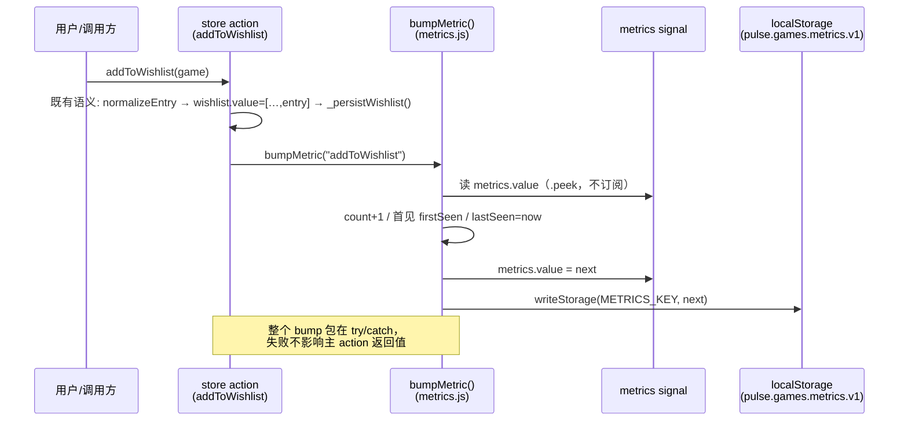
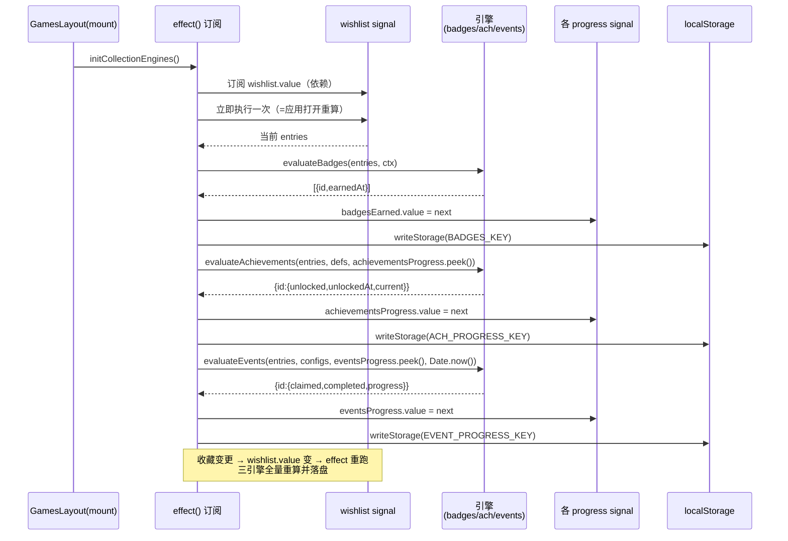
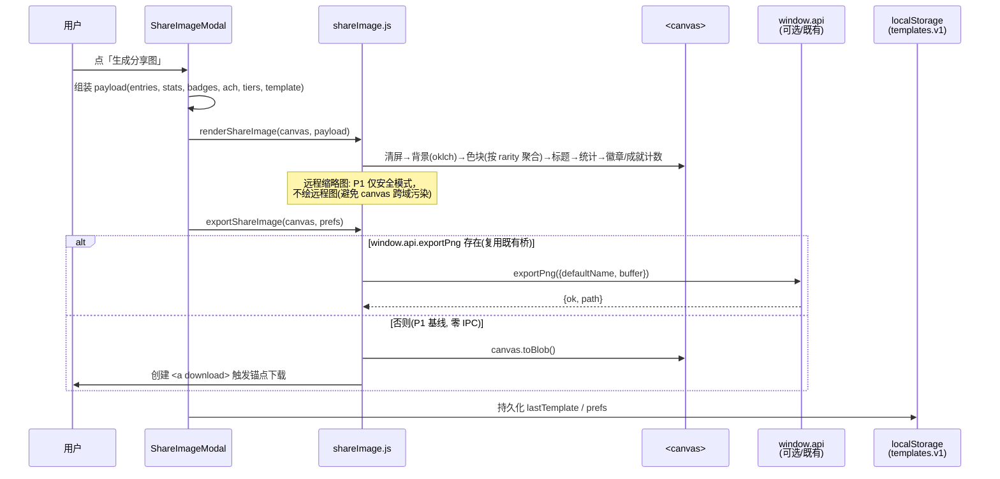
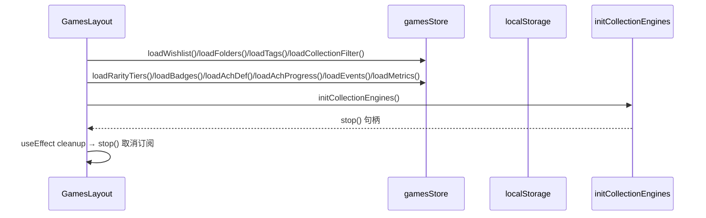
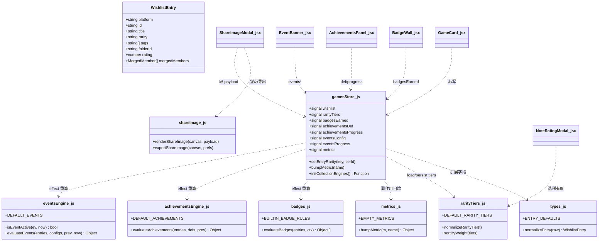
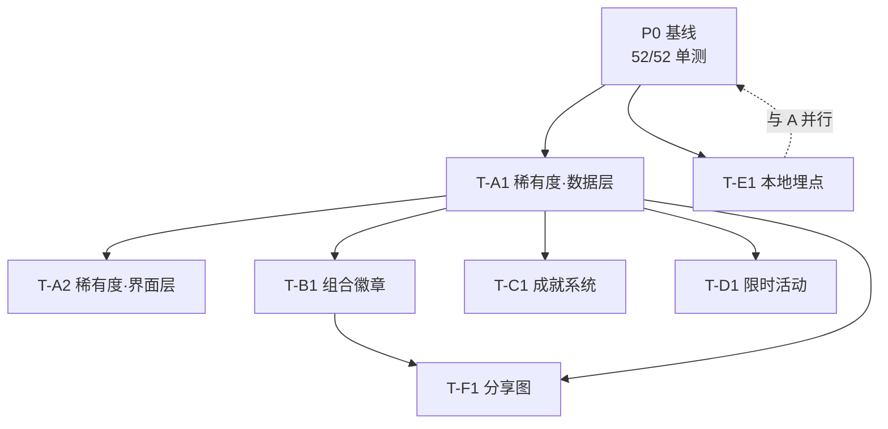

# Pulse 游戏收集模块 — 增量架构设计 + 任务分解（P1 / 阶段 2）

> **文档类型**：增量架构设计（architect deliverable）
> **作者**：高见远（software-architect）
> **日期**：2026-07-18
> **基线 commit**：`0b0f524`（P0 已交付，52/52 单测通过）
> **输入 PRD**：`docs/prd-games-collection-p1.md`（许清楚 已交付）
> **技术栈声明**：renderer = **Preact + preact/hooks + @preact/signals**；主进程 = Node CommonJS（Electron）；持久化 = **localStorage**；**无后端 / 无账号 / 无网络出口**。

---

## 0. 设计摘要（TL;DR）

- **零新增依赖、零新增 IPC、零网络出口**。全部复用 P0 的 `normalizeEntry` 单一真源、`readStorage/writeStorage`、ModalShell、oklch 设计令牌。
- **分三批交付**（P1a → P1b → P1c），每批独立可回滚：
  - **P1a**（最低风险）：A 稀有度 + E 本地埋点，纯加法 schema、无新引擎。
  - **P1b**（展示/导出）：B 组合徽章 + F 分享图，消费 P1a 数据，无调度引擎。
  - **P1c**（最重）：C 成就系统 + D 限时活动，本地引擎订阅 `wishlist` signal 自动重算。
- **衔接点**：store actions 经 `updateEntry`/`batch` 扩展；引擎经 `effect()` 订阅 `wishlist` 并 `.peek()` 避免自订阅死循环；埋点作为既有 action 的副作用、`try/catch` 吞错不破坏语义。
- **两处需用户拍板**：Q9 远程缩略图增强、Q10 saveDialog 指定路径，均因「无新增 IPC」硬约束在 P1 降级为安全模式 / 锚点下载（详见 §8）。

---

## 1. 增量实现方案 + 框架选型

### 1.1 框架选型与沿用声明

| 维度 | 决策 | 理由 |
|------|------|------|
| UI 框架 | 沿用 **Preact + preact/hooks + @preact/signals**（非 React） | P0 基线已验证，信号订阅范式成熟 |
| 持久化 | 沿用 **localStorage**（`readStorage`/`writeStorage` 封装） | 无后端，纯本地；向后兼容旧数据 |
| 状态 | 沿用 **signals**（`signal` / `batch` / `effect` / `.peek()`） | 引擎响应式重算靠 `effect` 订阅 `wishlist` |
| 图形 | **原生 `<canvas>` 2D API**（无库） | F 分享图；`canvas.toBlob` 导出，无第三方 |
| 颜色 | 沿用 **oklch + `color-mix`**（CSS 原生） | 遵守「禁止裸 hex」Stylelint 约束 |
| IPC | **无新增** | 复用既有 `readStorage`/缩略图 ``；远程增强延后 |

**依赖包清单：空。** 论证见 §6。

### 1.2 与 P0 的衔接点（实现必须遵守）

1. **Schema 默认值单一真源**（`types.js`）：新增字段只在 `ENTRY_DEFAULTS` 与 `normalizeEntry` 加法补全；组件/store 严禁散落默认值。
2. **store actions 扩展范式**：沿用 `updateEntry(key, mutator)` + `batch(() => { … })` + `_persistWishlist()`；新 signal 在文件顶部与既有 `folders/tags/activeCollectionFilter` 同区声明。
3. **signals 订阅范式**：引擎用 `effect(() => { … })` 订阅 `wishlist.value`；读取「上一次进度」必须用 `.peek()` 避免把自身 signal 变成依赖导致无限重算。
4. **localStorage 读写封装**：复用 `readStorage(key)` / `writeStorage(key, val)`；新 key 在 `gamesStore.js` 顶部 `KEY` 常量区集中登记（如 `RARITY_TIERS_KEY`），解析损坏数据静默回退默认。
5. **弹窗范式**：复用 `ModalShell`（`open` / `onClose` / `title` / `footer`），如 `NoteRatingModal`。
6. **设计令牌**：复用 `var(--token)`、`tabular-nums`、`-apple-system` 字体栈、`prefers-reduced-motion` 关动效；颜色用 `color-mix(in oklch, var(--color-xxx) …)` 做主题感知（浅色压暗 / 深色直引语义色）。

---

## 2. 文件列表（新建 / 修改，标注批次）

| 路径 | 类型 | 批次 | 职责 | 关键导出 / 接口 |
|------|------|------|------|----------------|
| `src/renderer/games/types.js` | 修改 | P1a | `WishlistEntry` 加 `rarity`；`normalizeEntry` 加法补全；导出 `RARITY_MIN/MAX` | `ENTRY_DEFAULTS`, `normalizeEntry` |
| `src/renderer/games/rarityTiers.js` | **新建** | P1a | 稀有度档位默认常量 + 归一化 + 排序 | `DEFAULT_RARITY_TIERS`, `normalizeRarityTier`, `sortByWeight`, `tierColorOf` |
| `src/renderer/games/metrics.js` | **新建** | P1a | 埋点纯函数（计数 + 时间戳） | `EMPTY_METRICS`, `bumpMetric`, `mergeMetrics` |
| `src/renderer/games/badges.js` | **新建** | P1b | 内置徽章规则表（代码常量）+ 响应式求值 | `BUILTIN_BADGE_RULES`, `evaluateBadges` |
| `src/renderer/games/achievementsEngine.js` | **新建** | P1c | 成就引擎（定义 + 自动检测 + 解锁历史） | `DEFAULT_ACHIEVEMENTS`, `evaluateAchievements` |
| `src/renderer/games/eventsEngine.js` | **新建** | P1c | 限时活动引擎（本地时钟 + 进度 + 历史） | `DEFAULT_EVENTS`, `isEventActive`, `evaluateEvents` |
| `src/renderer/games/shareImage.js` | **新建** | P1b | canvas 渲染 + 导出（零/IPC 锚点基线） | `renderShareImage`, `exportShareImage` |
| `src/renderer/games/gamesStore.js` | 修改 | 全批 | 扩 signal / load / action / 埋点钩子 / 引擎初始化 | `setEntryRarity`, `bumpMetric`, `initCollectionEngines`, … |
| `src/renderer/games/RarityPicker.jsx` | **新建** | P1a | 稀有度单选组件（含自定义档位） | `RarityPicker` |
| `src/renderer/games/BadgeWall.jsx` | **新建** | P1b | 徽章墙（图标 + 名称 + 获得日期） | `BadgeWall` |
| `src/renderer/games/AchievementsPanel.jsx` | **新建** | P1c | 成就视图（锁定/解锁 + 进度条复用 ProgressBar）+ 自建弹窗 | `AchievementsPanel` |
| `src/renderer/games/EventBanner.jsx` | **新建** | P1c | 活动 Banner（active 浮现 / 过期入历史） | `EventBanner` |
| `src/renderer/games/UsageMetricsPanel.jsx` | **新建** | P1a | 使用回顾面板（仅本地计数，标注不上传） | `UsageMetricsPanel` |
| `src/renderer/games/ShareImageModal.jsx` | **新建** | P1b | 分享图弹窗（调 shareImage.js） | `ShareImageModal` |
| `src/renderer/games/GameCard.jsx` | 修改 | P1a/P1b | 稀有度角标 + 更多菜单入口 + 徽章点亮 + 分享按钮 | — |
| `src/renderer/games/NoteRatingModal.jsx` | 修改 | P1a | 备注/评分弹窗内嵌稀有度选择 | — |
| `src/renderer/games/StatsOverview.jsx` | 修改 | P1a | 稀有度分布条 | — |
| `src/renderer/games/GamesPage.jsx` | 修改 | P1a/P1b/P1c | 稀有度降序排序 + 徽章墙/成就/活动/使用回顾/分享 入口 | — |
| `src/renderer/games/GamesLayout.jsx` | 修改 | 全批 | mount 时 load 新 key + `initCollectionEngines()` 订阅/卸载 | — |
| `src/renderer/games/games.css` | 修改 | 全批 | 新样式（稀有度色、徽章墙、成就、Banner、分享、回顾） | — |

> 命名取舍：遵循「最小变更 + 单一职责」，未新增独立 `rarityStore`/`engineStore`——新 signal 直接并入 `gamesStore.js`（与 P0 的 `folders/tags` 一致），引擎纯函数独立成文件（可单测、无信号依赖）。

---

## 3. 数据结构与接口（含默认值 & 向后兼容）

### 3.1 新增 Schema 汇总

| 功能 | localStorage Key | 结构 | 默认值 / 迁移 |
|------|------------------|------|---------------|
| A 稀有度字段 | (字段) `WishlistEntry.rarity` | `string\|null` | `null`；`normalizeEntry` 加法补全 |
| A 档位 | `pulse.games.rarity.tiers.v1` | `[{id,name,weight,color}]` | 默认 4 档；用户编辑后覆盖 |
| B 徽章 | `pulse.games.badges.earned.v1` | `{[badgeId]:{earnedAt}}` | `{}`；规则为代码常量不持久化 |
| C 成就(用户) | `pulse.games.achievements.def.v1` | `[{id,name,dimension,target,threshold}]` | `[]`；内置为代码常量 |
| C 成就进度 | `pulse.games.achievements.progress.v1` | `{[id]:{unlocked,unlockedAt,current}}` | `{}` |
| D 活动配置 | `pulse.games.events.config.v1` | `[{id,title,startAt,endAt,dimension,target,threshold}]` | `[]`；内置为代码常量 |
| D 活动进度 | `pulse.games.events.progress.v1` | `{[id]:{claimed,completed,progress}}` | `{}` |
| E 埋点 | `pulse.games.metrics.v1` | `{[event]:{count,firstSeen,lastSeen}}` | `{}` |
| F 分享 | `pulse.games.share.templates.v1` | `{lastTemplate, prefs}` | 默认模板为代码常量 |

### 3.2 `types.js` 扩展（伪代码）

```js
// ENTRY_DEFAULTS 加法补全（向后兼容：旧条目无 rarity 自动 null）
export const ENTRY_DEFAULTS = {
  tags: [], folderId: null, note: "", rating: 0,
  currentPrice: null, currentCurrency: null,
  mergedIds: [], mergedMembers: null,
  rarity: /** @type {string|null} */ (null),   // ← 新增
};

export function normalizeEntry(raw) {
  // …既有逻辑…
  return {
    // …既有字段…
    rarity: typeof raw.rarity === "string" ? raw.rarity : null,  // ← 加法补全
  };
}

export const RARITY_MIN = 0;   // 仅占位，实际枚举由 tiers 驱动
export const RARITY_MAX = 1;   // 语义化：unranked(null) < 任何已设档位
```

### 3.3 `rarityTiers.js`（新建，代码常量 + 纯函数）

```js
/** 默认 4 档（common/rare/epic/legendary），weight 越大越稀有。color 用 oklch 变量名或 oklch() 字符串。 */
export const DEFAULT_RARITY_TIERS = [
  { id: "common",    name: "普通",   weight: 1, color: "var(--color-neutral)" },
  { id: "rare",      name: "稀有",   weight: 2, color: "var(--brand-epic)" },
  { id: "epic",      name: "史诗",   weight: 3, color: "var(--color-info)" },
  { id: "legendary", name: "传说",   weight: 4, color: "var(--color-warning)" },
];

export function normalizeRarityTier(raw) {
  if (!raw || typeof raw !== "object") return null;
  const id = typeof raw.id === "string" && raw.id ? raw.id : null;
  if (!id) return null;
  return {
    id,
    name: typeof raw.name === "string" && raw.name ? raw.name : id,
    weight: Number.isFinite(Number(raw.weight)) ? Number(raw.weight) : 1,
    color: typeof raw.color === "string" && raw.color ? raw.color : "var(--color-neutral)",
  };
}

/** 按 weight 降序（用于排序与分布展示）。 */
export function sortByWeight(tiers) {
  return [...tiers].sort((a, b) => b.weight - a.weight);
}

/** 取某档位颜色；未知/ null 返回中性色。 */
export function tierColorOf(tiers, rarityId) {
  const t = (tiers || []).find((x) => x.id === rarityId);
  return t ? t.color : "var(--color-neutral)";
}
```

### 3.4 `metrics.js`（新建，纯函数，无网络）

```js
export const EMPTY_METRICS = {};

/**
 * 在 metrics 表上自增某事件计数（不可变更新）。
 * 首次出现写 firstSeen；每次写 lastSeen。
 * @param {{[k:string]:{count:number,firstSeen:string,lastSeen:string}}} metrics
 * @param {string} name
 * @returns {typeof metrics}
 */
export function bumpMetric(metrics, name) {
  const now = new Date().toISOString();
  const cur = metrics && metrics[name];
  const next = { ...(metrics || {}) };
  if (!cur) {
    next[name] = { count: 1, firstSeen: now, lastSeen: now };
  } else {
    next[name] = { count: cur.count + 1, firstSeen: cur.firstSeen, lastSeen: now };
  }
  return next;
}
```

### 3.5 `badges.js`（新建，内置规则表 + 求值，纯函数）

```js
/**
 * 内置徽章规则（代码常量，不持久化）。
 * 每条：id + 名称 + 命中判定(基于 entries / folders / tags / tiers)。
 */
export const BUILTIN_BADGE_RULES = [
  { id: "first_10",     name: "初露锋芒",   desc: "收藏满 10 款",    test: (c) => c.total >= 10 },
  { id: "first_merge",  name: "跨平台收藏家", desc: "完成首次合并",   test: (c) => c.mergedCount >= 1 },
  { id: "multiplat",    name: "全家桶",      desc: "同一游戏 ≥3 平台", test: (c) => c.maxPlatforms >= 3 },
  { id: "fully_rated",  name: "评分达人",    desc: "全部已评分",      test: (c) => c.total > 0 && c.rated === c.total },
  { id: "collector",    name: "收藏大师",    desc: "收藏满 50 款",    test: (c) => c.total >= 50 },
  { id: "folder_master",name: "收纳控",      desc: "创建 ≥3 收藏夹",  test: (c) => c.folderCount >= 3 },
  { id: "tagged",       name: "标签猎人",    desc: "使用 ≥5 标签",    test: (c) => c.tagKinds >= 5 },
  { id: "legendary",    name: "传说收藏",    desc: "拥有传说稀有度",   test: (c) => c.hasLegendary },
];

/**
 * 响应式求值：返回已点亮徽章 [{id, earnedAt}]。
 * @param {WishlistEntry[]} entries
 * @param {{tiers:object[],folders:object[],tags:object[]}} ctx
 */
export function evaluateBadges(entries, ctx) {
  const list = Array.isArray(entries) ? entries : [];
  const context = {
    total: list.length,
    rated: list.filter((e) => e.rating > 0).length,
    mergedCount: list.filter((e) => e.mergedMembers && e.mergedMembers.length).length,
    maxPlatforms: Math.max(0, ...list.map((e) =>
      (e.mergedMembers && e.mergedMembers.length) ? e.mergedMembers.length + 1 : 1)),
    folderCount: (ctx.folders || []).length,
    tagKinds: new Set(list.flatMap((e) => e.tags || [])).size,
    hasLegendary: list.some((e) => e.rarity === "legendary"),
  };
  const now = new Date().toISOString();
  return BUILTIN_BADGE_RULES
    .filter((r) => r.test(context))
    .map((r) => ({ id: r.id, earnedAt: now }));
}
```

### 3.6 `achievementsEngine.js`（新建，纯函数）

```js
/**
 * 成就规则（内置 + 用户自建同构）。
 * dimension ∈ tag|folder|platform|rarity|merged；target 为对应键（rarity 填 tierId，merged 忽略 target）。
 * 判定：count(命中条目) >= threshold → 解锁。
 */
export const DEFAULT_ACHIEVEMENTS = [
  { id: "ach_10_steam",   name: "Steam 十连", dimension: "platform", target: "steam",    threshold: 10 },
  { id: "ach_5_epic",     name: "Epic 五虎",  dimension: "platform", target: "epic",     threshold: 5 },
  { id: "ach_tag_rpg",    name: "RPG 控",     dimension: "tag",      target: "RPG",      threshold: 3 },
  { id: "ach_legendary",  name: "传说达成",   dimension: "rarity",   target: "legendary",threshold: 1 },
  { id: "ach_3_merged",   name: "合并大师",   dimension: "merged",   target: null,       threshold: 3 },
];

/** 统计某维度命中条数。 */
function countMatches(entries, dimension, target) {
  switch (dimension) {
    case "platform": return entries.filter((e) => e.platform === target).length;
    case "tag":      return entries.filter((e) => (e.tags || []).includes(target)).length;
    case "folder":   return entries.filter((e) => e.folderId === target).length;
    case "rarity":   return entries.filter((e) => e.rarity === target).length;
    case "merged":   return entries.filter((e) => e.mergedMembers && e.mergedMembers.length).length;
    default: return 0;
  }
}

/**
 * 自动检测解锁 + 保留解锁历史。
 * @param {WishlistEntry[]} entries
 * @param {object[]} defs  DEFAULT_ACHIEVEMENTS ∪ 用户自建
 * @param {object} prev     上一次 progress（.peek() 读取，避免自订阅）
 * @returns {{[id]:{unlocked:boolean,unlockedAt:string|null,current:number}}}
 */
export function evaluateAchievements(entries, defs, prev) {
  const out = {};
  const now = new Date().toISOString();
  for (const d of defs || []) {
    const current = countMatches(entries, d.dimension, d.target);
    const wasUnlocked = prev && prev[d.id] && prev[d.id].unlocked;
    const unlocked = wasUnlocked || current >= d.threshold;
    out[d.id] = {
      unlocked,
      unlockedAt: unlocked ? (wasUnlocked && prev[d.id].unlockedAt ? prev[d.id].unlockedAt : now) : null,
      current,
    };
  }
  return out;
}
```

### 3.7 `eventsEngine.js`（新建，纯函数，本地时钟）

```js
/**
 * 限时活动配置（内置 + 用户自建同构）。
 * startAt/endAt 为 ISO 字符串；rule 同成就规则。
 */
export const DEFAULT_EVENTS = [
  { id: "ev_spring", title: "春季收藏冲刺",
    startAt: "2026-03-01T00:00:00Z", endAt: "2026-03-31T23:59:59Z",
    dimension: "platform", target: "steam", threshold: 20 },
];

/** 活动是否在生效窗口内（本地时钟，无秒级倒计时）。 */
export function isEventActive(ev, now = Date.now()) {
  const s = new Date(ev.startAt).getTime();
  const e = new Date(ev.endAt).getTime();
  return !Number.isNaN(s) && !Number.isNaN(e) && now >= s && now <= e;
}

/**
 * 活动进度计算 + 过期锁定保留历史。
 * @returns {{[id]:{claimed:boolean,completed:boolean,progress:number}}}
 */
export function evaluateEvents(entries, configs, prev, now = Date.now()) {
  const out = {};
  for (const cfg of configs || []) {
    const p = (prev && prev[cfg.id]) || { claimed: false, completed: false, progress: 0 };
    const active = isEventActive(cfg, now);
    if (!active) {
      // 过期：保留 last progress，标记 completed（若曾达成），不再更新
      out[cfg.id] = { claimed: p.claimed, completed: p.completed, progress: p.progress };
      continue;
    }
    const progress = countMatches(entries, cfg.dimension, cfg.target);
    out[cfg.id] = { claimed: p.claimed, completed: progress >= cfg.threshold, progress };
  }
  return out;
}
```

### 3.8 `shareImage.js`（新建，纯 renderer，零 IPC）

```js
/**
 * 把当前收藏绘入 canvas（P1 安全模式：色块 + 标题 + 统计 + 徽章/成就计数）。
 * 远程缩略图 P1 不绘（避免 canvas 跨域污染）；待既有图片 IPC 通道开放后再增强。
 * @param {HTMLCanvasElement} canvas
 * @param {{entries:WishlistEntry[],stats:object,tiers:object[],badges:object[],achievements:object[],template:string}} payload
 */
export function renderShareImage(canvas, payload) { /* …原生 2D 绘制… */ }

/**
 * 导出 PNG。
 *  - 若存在 window.api.exportPng（复用既有 saveDialog 桥）→ 优先；
 *  - 否则（P1 基线，零 IPC）→ canvas.toBlob + <a download> 锚点下载。
 * @param {HTMLCanvasElement} canvas
 * @param {{template?:string, prefs?:object}} opts
 */
export async function exportShareImage(canvas, opts = {}) {
  const blob = await new Promise((res) => canvas.toBlob(res, "image/png"));
  if (typeof window !== "undefined" && window.api && typeof window.api.exportPng === "function") {
    const buf = new Uint8Array(await blob.arrayBuffer());
    const r = await window.api.exportPng({ defaultName: "pulse-games-share", buffer: buf });
    if (r && r.ok) return { ok: true, path: r.path };
  }
  // 零 IPC 降级
  const url = URL.createObjectURL(blob);
  const a = document.createElement("a");
  a.href = url; a.download = `pulse-games-${new Date().toISOString().slice(0, 10)}.png`;
  document.body.appendChild(a); a.click(); a.remove();
  URL.revokeObjectURL(url);
  return { ok: true, path: null };
}
```

### 3.9 `gamesStore.js` 扩展接口签名表

**新增 signal（顶部 KEY 区同批登记）**

| signal | 类型 | 说明 |
|--------|------|------|
| `rarityTiers` | `signal([])` | 当前稀有度档位（默认 4 档） |
| `badgesEarned` | `signal({})` | `{[id]:{earnedAt}}` |
| `achievementsDef` | `signal([])` | 用户自建成就 |
| `achievementsProgress` | `signal({})` | 解锁进度 |
| `eventsConfig` | `signal([])` | 用户自建活动 |
| `eventsProgress` | `signal({})` | 活动进度 |
| `metrics` | `signal({})` | 埋点计数 |

**新增 action / 函数**

| 函数 | 签名 | 说明 |
|------|------|------|
| `loadRarityTiers` | `()=>void` | 读 `RARITY_TIERS_KEY`，损坏回退默认 |
| `loadBadges` / `loadAchDef` / `loadAchProgress` / `loadEvents` / `loadMetrics` | `()=>void` | 各 key 载入 |
| `setEntryRarity` | `(key, tierId\|null)=>void` | 覆盖式单选；`null`=unranked |
| `batchSetCommonRarity` | `(keys:string[])=>void` | Q1「批量设为 common」 |
| `addRarityTier` / `renameRarityTier` / `deleteRarityTier` | `(…)=>void` | 自定义档位 CRUD + 持久化 |
| `addAchievement` / `updateAchievement` / `deleteAchievement` | `(…)=>void` | 用户自建成就 |
| `addEvent` / `updateEvent` / `deleteEvent` / `claimEvent` | `(…)=>void` | 活动配置 + 领取 |
| `bumpMetric` | `(name)=>void` | 调 `metrics.js`，`try/catch` 吞错 |
| `initCollectionEngines` | `()=>()=>void` | `effect()` 订阅 `wishlist`，返回 `stop()` 句柄 |

**埋点钩子接入点（N1）**：在 `addToWishlist` / `removeFromWishlist` / `setEntryTags` / `createFolder` / `mergeEntries` / `splitEntry` / `setRating` / `setNote` / `setEntryRarity` 各自语义执行后追加 `bumpMetric("<对应事件名>")`。

---

## 4. 程序调用流程（Mermaid）

### 4.1 N1 — 埋点钩子作为 action 副作用（不破坏既有语义）



### 4.2 N2 — 引擎订阅 `wishlist` signal 自动重算（收藏变更 / 应用打开）



### 4.3 N3 — 分享图生成与导出（P1 零/IPC 基线）



### 4.4 启动装配（GamesLayout mount → load + initEngines）



### 4.5 模块 / 类依赖（classDiagram）



---

## 5. 任务列表（P1a → P1b → P1c，含依赖 / 验收）

> 说明：本任务表按 PRD 明确要求「按 P1a→P1b→P1c 实现顺序排列、同批并行项标注」，故**有意超过通用模板的 5 任务上限**——分批可回滚交付是 PRD 第 3 节的硬约束，优先级高于模板默认值。

### P1a — 数据增强 & 轻量埋点（最低回归风险）

| Task | 目标 | 涉及文件 | 依赖 | 并行 | 验收钩子 |
|------|------|----------|------|------|----------|
| **T-A1** 稀有度·数据层 | schema 扩展 + 档位持久化 + store actions | `types.js`(改)、`rarityTiers.js`(新)、`gamesStore.js`(改) | P0 基线 | 与 T-E1 并行 | `normalizeEntry` 加法补全 `rarity=null`；`loadRarityTiers` 默认 4 档持久化；`setEntryRarity`/`batchSetCommonRarity`/`addRarityTier`/`renameRarityTier`/`deleteRarityTier` 单测通过；旧数据无 rarity 自动 null |
| **T-A2** 稀有度·界面层 | 入口 + 角标 + 分布 + 降序排序 | `RarityPicker.jsx`(新)、`GameCard.jsx`(改)、`NoteRatingModal.jsx`(改)、`StatsOverview.jsx`(改)、`GamesPage.jsx`(改)、`games.css`(改) | T-A1 | — | 卡片「更多」可选稀有度即时落盘；角标按 tier 色；NoteRatingModal 含 RarityPicker；StatsOverview 增稀有度分布；收藏网格支持按稀有度降序（unranked 排末尾）；oklch/a11y 合规 |
| **T-E1** 本地埋点 | metrics.v1 + 9 处副作用钩子 + 回顾面板 | `metrics.js`(新)、`gamesStore.js`(改)、`UsageMetricsPanel.jsx`(新)、`games.css`(改) | P0 基线 | 与 T-A1 并行（最后在 gamesStore 钩子处汇合） | 9 个 action 后对应 event `count+1`、firstSeen/lastSeen 写入；面板只读本地计数、标注「仅本地，不上传」；不触发任何网络；不影响既有 action 返回值 |

### P1b — 展示与导出层

| Task | 目标 | 涉及文件 | 依赖 | 并行 | 验收钩子 |
|------|------|----------|------|------|----------|
| **T-B1** 组合徽章 | 内置规则表 + 响应式求值 + 徽章墙 | `badges.js`(新)、`BadgeWall.jsx`(新)、`GameCard.jsx`(改)、`games.css`(改) | T-A1 | 与 T-F1 并行 | 内置 N 条规则命中即点亮；徽章墙显示图标+名称+获得日期；收藏变更经 effect 自动重算落盘 `pulse.games.badges.earned.v1`；未命中不显示 |
| **T-F1** 分享图 | canvas 渲染 + 导出（锚点基线 / 可选 saveDialog） | `shareImage.js`(新)、`ShareImageModal.jsx`(新)、`GameCard.jsx`(改)、`games.css`(改) | T-A1、T-B1 | 与 T-B1 并行 | 点「生成分享图」canvas 绘出色块+标题+统计+徽章/成就计数；导出 PNG（P1 基线=锚点下载零 IPC；若既有 saveDialog 桥存在则优先）；尊重 `prefers-reduced-motion`；模板偏好持久化 `share.templates.v1`；远程缩略图 P1 仅安全模式不绘 |

### P1c — 本地引擎（最重）

| Task | 目标 | 涉及文件 | 依赖 | 并行 | 验收钩子 |
|------|------|----------|------|------|----------|
| **T-C1** 成就系统 | 定义存储 + 自动解锁检测 + 解锁历史 + 视图 | `achievementsEngine.js`(新)、`gamesStore.js`(改)、`AchievementsPanel.jsx`(新)、`games.css`(改) | T-A1 | 与 T-D1 并行 | 内置+用户自建成就；收藏变更自动检测解锁并写 `unlockedAt`；视图区分锁定/解锁复用 `ProgressBar` 显示 `current/threshold`；用户自建持久化 `achievements.def.v1` |
| **T-D1** 限时活动 | 本地调度 + Banner 浮现 / 过期入历史 | `eventsEngine.js`(新)、`gamesStore.js`(改)、`EventBanner.jsx`(新)、`games.css`(改) | T-A1 | 与 T-C1 并行 | 配置持久化 `events.config.v1`；`[startAt,endAt]` 自动浮现、过期自动隐藏至历史；进度按当前收藏实时算；到期锁定保留历史 `events.progress.v1`；无秒级倒计时，仅相对时间 |

### 任务依赖图



---

## 6. 依赖包列表

**预期为空（零新增依赖）。**

| 候选 | 结论 | 论证 |
|------|------|------|
| `@preact/signals` 的 `effect` | 沿用既有 | P0 已装；`effect`/`peek` 原生支持 |
| canvas 库（konva/fabric） | **不引入** | 分享图为静态色块+文字，原生 2D API 足够 |
| 日期库（dayjs/date-fns） | **不引入** | 仅用 `new Date().toISOString()` / `Intl`，PRD Q7 明确无秒级倒计时 |
| 图片处理（sharp/jimp） | **不引入** | P1 远程缩略图延后；安全模式无需解码 |
| 新 IPC 通道 | **不新增** | PRD「新增 IPC 白名单：无」；复用既有 `readStorage` 与 `` 缩略图 |

---

## 7. 共享知识（跨文件约定）

1. **命名规范**：新文件小驼/短横线并存（与 P0 一致：`rarityTiers.js`、`BadgeWall.jsx`、`shareImage.js`）；signal 用 `camelCase`；localStorage key 用 `pulse.games.<域>.v1`；动作函数 `setXxx` / `addXxx` / `loadXxx` 仿 P0。
2. **signals 订阅/取消范式**：
   - 订阅：`const stop = effect(() => { /* 读 wishlist.value 作为依赖 */ });`
   - 防自循环：引擎读取上一次进度用 `xxxProgress.peek()`（不订阅）。
   - 取消：`GamesLayout` 的 `useEffect` cleanup 中调 `stop()`，避免内存泄漏 / 重复订阅。
3. **localStorage 读写封装**：一律走 `readStorage(key)` / `writeStorage(key, val)`（已在 `gamesStore.js`）；新 key 集中在文件顶部 `KEY` 常量区登记；解析损坏数据静默回退默认（仿 `loadFolders`）。
4. **oklch / tabular-nums / a11y 约定**：
   - 颜色只用 `var(--token)` 或 `color-mix(in oklch, …)`，**禁止裸 hex**（Stylelint `color-no-hex`）。
   - 数值一律 `font-variant-numeric: tabular-nums`。
   - 正文对比 ≥4.5:1、UI ≥3:1；焦点环；触控 ≥44px；`prefers-reduced-motion` 关动效。
   - 系统字体栈 `-apple-system, …`（沿用 `games.css` 现有）。
5. **新增 key 的常量管理位置**：localStorage key 常量 → `gamesStore.js` 顶部 `KEY` 区；Schema 默认值 → `types.js`（条目）/`rarityTiers.js`（档位）；引擎内置规则 → 各自引擎文件顶部 `DEFAULT_*` 常量；模板默认 → `shareImage.js` 常量。
6. **颜色分层（主题感知）**：浅色主题用 `color-mix(in oklch, var(--color-xxx) 38%, black)` 压暗保证浅底可读；深色主题改用语义色直引（仿 `games.css` 的 `--games-rating`/`--games-save` 写法）。

---

## 8. 待明确事项（PRD Q1–Q10 分类）

| 问题 | 分类 | 对实现的约束影响 |
|------|------|------------------|
| **Q1** 稀有度默认语义（unset=null，unranked 排末尾，批量设 common） | ✅ 已采纳推荐默认 | T-A1 加 `batchSetCommonRarity`；排序 unranked 恒末位；`rarity` 默认 `null` |
| **Q2** 稀有度不影响金额统计 | ✅ 已采纳 | `computeCollectionStats` 不改；仅影响分布与排序 |
| **Q3** 自定义价值标签 vs tags 区分（rarity 单选互斥 / tags 多选） | ✅ 已采纳 | `setEntryRarity` 覆盖式单选；UI 与标签区视觉分离 |
| **Q4** B 与 C 不强制合并 | ✅ 已采纳 | `badges.js` 独立实现，不依赖 `achievementsEngine`；后续可选把 B 规则注册进 C |
| **Q5** 成就维度（tag/folder/platform/rarity/merged + 阈值；暂不支持价/时间窗） | ✅ 已采纳 | `achievementsEngine` rule schema 按 5 维度设计 |
| **Q6** 内置活动随版本、用户可自建、不联网、结束留历史 | ✅ 已采纳 | `DEFAULT_EVENTS` 常量 + `events.config.v1` 用户；`evaluateEvents` 过期锁历史 |
| **Q7** 无秒级倒计时，开/变更重算，相对时间 | ✅ 已采纳 | 引擎 `effect` 在 mount + 收藏变更时重算；`EventBanner` 仅显示相对时间 |
| **Q8** 埋点仅计数 + 时间戳，无明细，不上传 | ✅ 已采纳 | `metrics` schema 仅 `{count,firstSeen,lastSeen}`；`UsageMetricsPanel` 只读聚合 |
| **Q9** 远程缩略图跨域污染 | ⚠️ **部分采纳 / 仍建议拍板** | P1 先交付「色块+标题」安全模式（已采纳）；远程图增强需主进程图片 IPC 通道，而当前**无既有图片下载 IPC** 且 PRD 硬约束「无新增 IPC」→ **P1 不实现远程缩略图绘制**，待用户拍板是否开放图片下载 IPC 后再增强 |
| **Q10** 导出优先 Electron saveDialog 指定路径 | ⚠️ **建议拍板** | `dialog.showSaveDialog` 属主进程 IPC，当前 renderer 桥未暴露该能力，且 PRD「新增 IPC 白名单：无」。故 **P1 基线降级为纯 renderer 锚点下载（零 IPC）**；若用户要求 saveDialog，须同意在既有白名单内复用/扩展（如 `stocks:export-*` 同类），否则不新增独立合约 |

---

## 9. 风险与回归保护

- **纯加法 schema**：所有新字段经 `normalizeEntry` 加法补全，旧 wishlist 数据无缝升级（已验证 P0 单测 52/52 仍应全绿）。
- **零新引擎放最前**：P1a 只有 schema 扩展 + 埋点副作用，无订阅/调度逻辑，回归面最小。
- **引擎死循环防护**：引擎用 `.peek()` 读旧进度，避免把自身 signal 设为 `effect` 依赖。
- **埋点不破坏语义**：`bumpMetric` 全程 `try/catch`，任何异常不影响主 action 返回与持久化。
- **可回滚**：三批独立交付，每批对应独立 PR，出问题可单批 revert 不影响其他批次。

## 10. 验收总览（Definition of Done）

- [ ] P1a：稀有度可选/排序/分布落盘；9 处埋点计数准确且零网络。
- [ ] P1b：徽章墙响应式点亮；分享图 canvas 渲染 + 锚点导出 PNG（含安全模式）。
- [ ] P1c：成就自动解锁 + 历史；活动 active 浮现 / 过期入历史。
- [ ] 全量：沿用 oklch / tabular-nums / a11y；无新依赖、无新 IPC、无网络出口；P0 单测基线不回退。
- [ ] Q9 / Q10 两项待用户拍板项已记录并给出 P1 降级方案。
