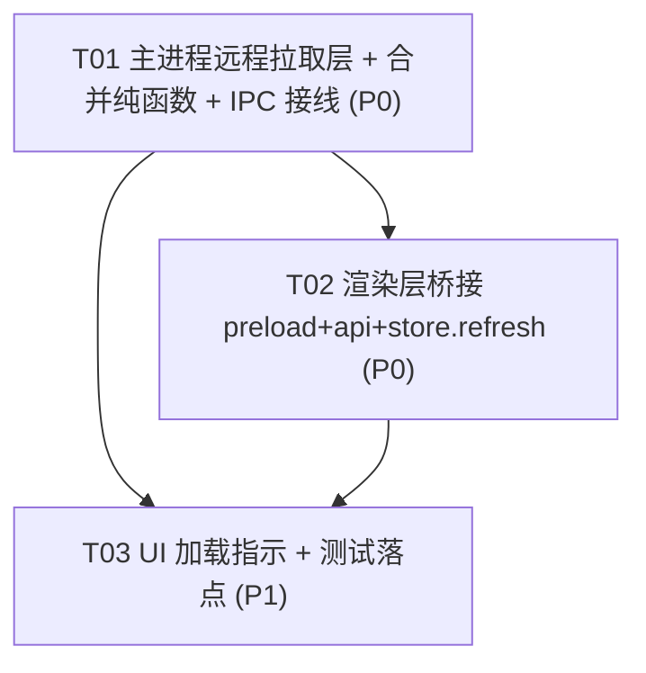

# 「新车发布」远程自动加载 · 增量设计 + 任务分解（Delta）

> **作者**：高见远（Architect）
> **输入**：PM 许清楚《newcar 远程自动加载增量 PRD》+ 主理人拍板项 + 实际代码 grounding（`src/main/ipc/*`、`src/main/http-client.js`、`preload.js`、`src/renderer/api.js`、`src/renderer/store/newcar-store.js`、`src/newcar/dataset.js`、`src/newcar/types.js`、`NewCarReleasePage.jsx`、`toast-store.js`、`tests/newcar/*`）
> **范围**：在 MVP（`docs/newcar/system_design.md`，115 条内置真源已落地）基础上，新增「手动刷新 → 主进程拉取远程真源 → 远程优先覆盖合并进内置日历」增量。**聚焦 delta，不重写 MVP 全量架构**。
> **约定**：章节号沿用标准模板（Part A 系统设计 / Part B 任务分解）；凡标注 `[新]`/`[改]` 即本增量改动面。

---

## 0. 代码核对结论（PM 假设 vs 真实代码）

| # | PM 假设 | 真实代码核对 | 结论 |
|---|---|---|---|
| 1 | `ctx.safeHandle("newcar:refresh", …)` 可用 | `src/main/ipc/context.js` 确有 `safeHandle(channel, fn, opts)`，内部 `ipcMain.handle` + try/catch 包成 `{ok:false,reason:'threw',error}` | ✅ 一致 |
| 2 | `HttpClient.get(url,{follow,timeout})` 返回 `{status,body,headers,error}` | `src/main/http-client.js` 实测签名一致；默认 `maxRetries=1`（网络/超时自动重试 1 次） | ✅ 一致 |
| 3 | `dataset.normalize()` 过滤缺 `id` / `releaseDate` 非 `YYYY-MM-DD` | `dataset.js` 实测：过滤 `!id` 与 `!/^\d{4}-\d{2}-\d{2}$/.test(releaseDate)` | ✅ 一致（但**仅 ESM/渲染层可用**，见 #9） |
| 4 | `newcar-store` 已有 `newCarReleases/Loading/Error/LastUpdate` 信号；`refresh()`=`loadCached()` | `newcar-store.js` 实测：信号齐备；`refresh()` 当前即 `loadCached()`，注释明写「未来 P1 可改为 main IPC 拉取 + 合并远程增量」 | ✅ 一致（本期落地该注释） |
| 5 | `preload.js` 暴露 `newcarRefresh: () => ipcRenderer.invoke("newcar:refresh")` | `preload.js` 有 `wechatHotRefresh` 同款模式（L203-204），新增完全同构 | ✅ 一致 |
| 6 | `api.createApi()` 增 `newcarRefresh: pick(overrides,"newcarRefresh")` | `api.js` 实测 `pick()` 机制：缺 bridge 时 dev warn 一次并 fallback `noop`，不崩 | ✅ 一致 |
| 7 | `ipc/index.js` 增 `registerNewCarHandlers(ctx)` 调用 | `ipc/index.js` 已有 `registerWechatHotHandlers(ctx)` 同款接线 | ✅ 一致 |
| 8 | `toast-store.showToast(msg,type,ms)` 可复用 | `toast-store.js` 实测 `showToast(message, type="info", ms=5000)` | ✅ 一致 |
| 9 | 主进程 handler 调 `normalize()` 清洗远程 | **主进程 = CommonJS（`package.json` 无 `type:module`）；`src/newcar/dataset.js` 是 ESM（`import builtin from './newcar-2026.json'`）。主进程无任何先例 `require` ESM 的 `newcar/*` 模块** | ⚠️ **偏差**：handler 内联一个最小等价 `normalizeReleases()`（id + releaseDate 正则），不 `require` dataset.js（跨越 ESM/CJS 边界会崩） |
| 10 | `NewCarReleasePage` 刷新按钮「loading 时 disabled + 刷新中… + 图标旋转」 | JSX 实测：`disabled={data.loading}` + `{data.loading ? '刷新中…' : '刷新'}` ✅；但 `styles.css` **无 `.newcar-refresh` 旋转规则**，图标无 `is-spin` 类 | ⚠️ **偏差**：旋转不存在，需复用现有 `@keyframes spin` 补 2 行 CSS + 给 `IconRefresh` 加 `is-spin` 类（P1-2 仅「复用加载指示」，旋转是补完而非新造） |
| 11 | `refresh()` 改写不破坏现有测试 | `tests/newcar/newcar-store.test.js` 用 `vi.mock('../../src/renderer/api.js', () => ({ api: { onSidenavBadge } }))` —— **未 mock `newcarRefresh`**，且断言 `refresh()` 重载出 115 条内置 | ⚠️ **偏差**：IPC 化 `refresh()` 会让该测试崩（`api.newcarRefresh` 为 `undefined`→调用即 TypeError）。**必须更新测试 mock**（见 §7 T03 / §10） |
| 12 | `DEFAULT_NEWCAR_REMOTE_URL` = gist raw | 主理人托管常量已确认：`https://gist.githubusercontent.com/Cnnnnnn/7fb25c169e4577511fbf5c76bdd9a919/raw/newcar-2026.json` | ✅ 一致 |

---

## Part A：系统设计（增量）

### 1. 实现方案（Implementation Approach）

#### 1.1 技术难点与决策

| 难点 | 决策 | 理由 |
|---|---|---|
| 远程拉取放哪 | **主进程**（main IPC）拉取，renderer 不直连 | 主进程 `HttpClient` 无浏览器 CORS 限制；gist raw 可匿名 GET |
| 渲染层桥接 | 沿用现有三层：`preload.js`（`ipcRenderer.invoke`）→ `api.js`（`pick`）→ `store`（`refresh()`） | 与 `wechatHot` 完全同构，单向 `invoke`，不建 push |
| 合并逻辑落点 | **渲染层**纯函数 `mergeByRemoteFirst(local, remote)`（`src/newcar/merge.js`，ESM，可单测） | 纯函数幂等，单测友好；远程数据经主进程 `normalizeReleases` 已清洗 |
| 主进程能否复用 `dataset.normalize` | **不能**（CJS/ESM 边界）→ 主进程 handler **内联**最小 `normalizeReleases` | 主进程 CJS，`require` ESM 的 `dataset.js` 会抛「Cannot use import outside a module」 |
| 失败策略 | 静默回退内置：保留当前 `newCarReleases`，置 `newCarError`，弹错误 toast | PM P0-4 + 主理人拍板「离线静默回退」 |
| 重试 | 仅 `HttpClient` 默认 `maxRetries=1`（网络/超时各重试 1 次）；**不挂自动/定时重试** | PM P1-3 |
| 依赖 | **零新增**（HttpClient/normalize 等价/toast/signals 均已有） | — |

#### 1.2 架构模式（增量视角）

- **主进程 handler（CJS）**：`register-newcar.js` 用 `ctx.safeHandle` 注册 `newcar:refresh`；内部 `new HttpClient({timeout:10000,maxRetries:1}).get(URL,{follow:true,timeout:10000})`；做 shape 校验 + 内联 normalize；返回 `RefreshResult`。任何异常由 `safeHandle` 兜底为 `{ok:false,reason:'threw'}`，**不崩主进程**。
- **渲染层桥接（同 wechatHot）**：`preload.js` 暴露 `newcarRefresh`；`api.js` 的 `createApi()` 增 `newcarRefresh: pick(overrides,"newcarRefresh")`；`ipc/index.js` 增 `registerNewCarHandlers(ctx)` 调用。
- **Store 改写**：`refresh()` 改为 `await api.newcarRefresh()` → 成功 `mergeByRemoteFirst(builtinBaseline, res.releases)` 写信号 + `showToast` 成功；失败保留数据 + `showToast` 错误。模块级 `builtinBaseline = normalize(loadBuiltinCalendar().releases)` 保证幂等稳定。
- **UI 加载指示复用**：`NewCarReleasePage` 现有 `disabled` + 「刷新中…」已生效；补图标旋转（复用 `@keyframes spin`）。

---

### 2. 文件列表（本增量改动面）

> 标注：`[新]` 新建 · `[改]` 修改现有

| 路径 | 类型 | 增量说明 | 对应 PRD |
|---|---|---|---|
| `src/main/ipc/register-newcar.js` | CJS（main） | **新**：`registerNewCarHandlers(ctx)` + `handleNewcarRefresh()` + 内联 `normalizeReleases` + 常量 `DEFAULT_NEWCAR_REMOTE_URL` | P0-1, P0-2, P1-4 |
| `src/main/ipc/index.js` | CJS（main） | **改**：`require("./register-newcar")` + 在 `registerWechatHotHandlers(ctx)` 后调用 `registerNewCarHandlers(ctx)` | P0-5 |
| `src/newcar/merge.js` | ESM（纯函数） | **新**：`mergeByRemoteFirst(local, remote)`（远程优先覆盖合并，幂等） | P0-3 |
| `preload.js` | CJS（preload） | **改**：`api` 对象增 `newcarRefresh: () => ipcRenderer.invoke("newcar:refresh")` | P0-5 |
| `src/renderer/api.js` | ESM | **改**：`createApi()` 增 `newcarRefresh: pick(overrides,"newcarRefresh")` | P0-5 |
| `src/renderer/store/newcar-store.js` | ESM | **改**：`refresh()` 改写（调 IPC + merge + toast）；模块级 `builtinBaseline`；import `mergeByRemoteFirst` + `showToast` | P0-4, P1-1, P2-1 |
| `src/renderer/components/NewCarReleasePage.jsx` | ESM | **改**：`IconRefresh` 加 `class={data.loading ? "is-spin" : ""}`（旋转落点） | P1-2 |
| `styles.css` | CSS | **改**：在 `/* New Car Release */` 段补 `.newcar-refresh svg.is-spin { animation: spin 0.8s linear infinite; }` | P1-2 |
| `tests/newcar/merge.test.js` | 测试 | **新**：`mergeByRemoteFirst` 单测（覆盖/补入/保留/幂等/非法丢弃） | P0-3 |
| `tests/newcar/newcar-store.test.js` | 测试 | **改**：`api` mock 增 `newcarRefresh`；补充 `refresh()` 成功/失败路径断言 | P0-4, P1-1 |

---

### 3. 数据结构与接口（Data Structures & Interfaces）

#### 3.1 主进程返回结构 `RefreshResult`

```ts
// 主进程 newcar:refresh 返回值
interface RefreshResult {
  ok: boolean;
  releases?: ReleaseRecord[];   // ok:true 时：经主进程内联 normalize 的远程数组（已过滤非法行）
  source?: string;              // ok:true 时：本次拉取地址（= DEFAULT_NEWCAR_REMOTE_URL）
  fetchedAt?: number;           // ok:true 时：主进程拉取完成 epoch ms（renderer 用作 newCarLastUpdate）
  reason?: "no_url" | "network" | "timeout" | "parse_failed" | "threw";  // ok:false 时
  error?: string;               // ok:false 时可选调试信息
}
```

#### 3.2 关键函数签名

```ts
// src/newcar/merge.js (ESM, 纯函数, 可单测)
/**
 * 远程优先覆盖合并。
 * - 远程有 id → 覆盖本地同 id
 * - 远程独有 id → 补入
 * - 本地 builtin 独有 id → 保留
 * 纯函数、幂等：mergeByRemoteFirst(baseline, remote) 多次调用结果稳定。
 * @param {ReleaseRecord[]} local   基线（builtinBaseline，已 normalize）
 * @param {ReleaseRecord[]} remote  远程（已 normalize）
 * @returns {ReleaseRecord[]} 合并后数组
 */
export function mergeByRemoteFirst(local, remote) { /* ... */ }

// src/main/ipc/register-newcar.js (CJS)
const DEFAULT_NEWCAR_REMOTE_URL =
  "https://gist.githubusercontent.com/Cnnnnnn/7fb25c169e4577511fbf5c76bdd9a919/raw/newcar-2026.json";
function registerNewCarHandlers(ctx) { /* ctx.safeHandle("newcar:refresh", ...) */ }
function handleNewcarRefresh() { /* HttpClient.get → shape 校验 → 内联 normalizeReleases → RefreshResult */ }
function normalizeReleases(raw) { /* 等价于 dataset.normalize 的最小实现（id + releaseDate 正则）*/ }

// src/renderer/store/newcar-store.js (ESM) —— refresh() 新签名
/**
 * 手动刷新：主进程拉取远程真源 → 远程优先合并进内置基线 → 写信号 + toast。
 * @returns {Promise<{ok:boolean, reason?:string}>}
 */
export async function refresh() { /* ... */ }
```

#### 3.3 类图（增量，完整版见 `docs/newcar/autoupdate-class.mermaid`）

```mermaid
classDiagram
    class NewCarRefreshHandler {
        +string DEFAULT_NEWCAR_REMOTE_URL
        +registerNewCarHandlers(ctx)
        -handleNewcarRefresh() RefreshResult
        -normalizeReleases(raw) ReleaseRecord[]
    }
    class HttpClient {
        +get(url, opts) Promise
    }
    class MergeModule {
        +mergeByRemoteFirst(local, remote) ReleaseRecord[]
    }
    class NewCarStore {
        +signal newCarReleases
        +signal newCarLoading
        +signal newCarError
        +signal newCarLastUpdate
        -builtinBaseline ReleaseRecord[]
        +refresh() Promise
    }
    class ApiBridge {
        +newcarRefresh() Promise
    }
    class NewCarReleasePage {
        +onRefresh()
    }
    class ToastStore {
        +showToast(msg, type, ms)
    }
    NewCarRefreshHandler ..> HttpClient : 使用
    ApiBridge ..> NewCarRefreshHandler : ipcRenderer.invoke("newcar:refresh")
    NewCarStore ..> ApiBridge : api.newcarRefresh()
    NewCarStore ..> MergeModule : mergeByRemoteFirst(builtinBaseline, remote)
    NewCarStore ..> ToastStore : 成功/失败 toast
    NewCarReleasePage ..> NewCarStore : onRefresh→refresh()
```

---

### 4. 程序调用流程（增量，完整版见 `docs/newcar/autoupdate-sequence.mermaid`）

```mermaid
sequenceDiagram
    autonumber
    actor User
    participant Page as NewCarReleasePage
    participant Store as newcar-store.refresh
    participant Api as api.newcarRefresh
    participant Pre as preload.newcarRefresh
    participant Main as registerNewCarHandlers(newcar:refresh)
    participant HC as HttpClient
    participant Toast as toast-store

    User->>Page: 点击「刷新」
    Page->>Store: onRefresh() → refresh()
    Store->>Store: newCarLoading = true
    Store->>Api: await api.newcarRefresh()
    Api->>Pre: ipcRenderer.invoke("newcar:refresh")
    Pre->>Main: ipcMain.handle → safeHandle 包裹
    Main->>HC: get(DEFAULT_NEWCAR_REMOTE_URL,{follow:true,timeout:10000})
    HC-->>Main: {status, body, error}
    Main->>Main: shape 校验 + 内联 normalizeReleases
    Main-->>Pre: RefreshResult
    Pre-->>Api: 同结果
    Api-->>Store: 同结果
    alt ok:true
        Store->>Store: merged = mergeByRemoteFirst(builtinBaseline, releases)
        Store->>Store: newCarReleases = merged; newCarLastUpdate = fetchedAt; newCarError = null
        Store->>Toast: showToast("已同步最新发布日历（N 条）","success")
    else ok:false
        Store->>Store: 保留当前数据; newCarError = reason
        Store->>Toast: showToast(reasonToast(reason),"error")
    end
    Store->>Store: newCarLoading = false
    Store-->>Page: {ok, reason?}
    Page-->>User: 按钮恢复可用 / 错误提示
```

---

### 5. 待明确事项 / 偏差汇总（Anything UNCLEAR）

1. **CJS/ESM 边界（已决策）**：主进程 `register-newcar.js` 不 `require` ESM 的 `src/newcar/dataset.js`，改内联 `normalizeReleases`。合并纯函数仍放 ESM `src/newcar/merge.js`（供 renderer + 单测用）。
2. **图标旋转不存在（已决策补完）**：`NewCarReleasePage` 仅 `disabled` + 文案切换；旋转用现有 `@keyframes spin` 复用，非新造动画。
3. **测试 mock 必须更新**：`tests/newcar/newcar-store.test.js` 现有 `api` mock 缺 `newcarRefresh`，IPC 化 `refresh()` 后该测试会崩；按 §7 T03 改 mock（`newcarRefresh` 默认返 `{ok:true,releases:[],fetchedAt:Date.now()}`，合并后仍为 115 条，`refresh()` 断言不变）。
4. **错误文案映射**（PM 仅列 no_url/network/timeout/parse_failed，补 `threw` 兜底）：
   - `no_url` / `network` → `无法连接新车数据源，已继续使用内置日历`
   - `timeout` → `连接新车数据源响应超时，已继续使用内置日历`
   - `parse_failed` → `新车数据源返回格式异常，已继续使用内置日历`
   - `threw`（兜底）→ `刷新新车数据源失败，已继续使用内置日历`
   - 成功 → `已同步最新发布日历（${merged.length} 条）`（P2-1）
5. **空 releases**：主进程返 `{ok:true, releases:[]}` → renderer 合并得 `builtinBaseline`（仍 115 条），弹**成功** toast（N=115），**不**弹错误（主理人拍板）。
6. **`too_large`**：HttpClient 在 body>1MB 时返 `error:'too_large'`；本 JSON 极小不会触发，handler 将 `too_large` 归并到 `parse_failed`。
7. **延后项（本期不做）**：P2-2 config 覆盖地址、P2-3 离线持久化、P2-4 变更角标；`newcar:refresh` 单向 invoke，不建 push channel。

---

## Part B：任务分解（Task Decomposition）

### 6. 依赖包列表（Required Packages）

**本增量新增依赖：0（零新增）**

| 包 / 能力 | 状态 | 用途 |
|---|---|---|
| `src/main/http-client.js`（`HttpClient`） | 已存在，复用 | 主进程远程 GET（timeout/follow/retry） |
| `src/renderer/store/toast-store.js`（`showToast`） | 已存在，复用 | 成功/失败反馈 |
| `@preact/signals` | 已存在，复用 | store 信号 |
| `src/main/ipc/context.js`（`safeHandle`） | 已存在，复用 | handler 注册 + 异常兜底 |
| `src/newcar/dataset.js`（`loadBuiltinCalendar`/`normalize`） | 已存在，渲染层复用 | 基线 + 远程数据清洗（仅渲染层调用） |

> 结论：**零新增依赖**，仅新增 2 个源文件（main handler + merge 纯函数）+ 修改 4 个现有文件 + 2 个测试。

### 7. 任务列表（有序，含依赖）

> 约束：≤5 任务、每任务 ≥3 文件、T01 为本增量基础层（对应「项目基础设施」的增量等价物——无新配置/入口/依赖，故以「主进程 IPC + 合并纯函数 + 接线」作为一切依赖之根）。每个任务内部可小批实现。

| TaskID | 任务名 | 源文件（Source Files） | 依赖 | 优先级 | 备注 / 工程师执行要点 |
|---|---|---|---|---|---|
| **T01** | 主进程远程拉取层 + 合并纯函数 + IPC 接线 | `src/main/ipc/register-newcar.js` **[新]** · `src/main/ipc/index.js` **[改]** · `src/newcar/merge.js` **[新]** | 无 | P0 | ① `register-newcar.js`：常量 `DEFAULT_NEWCAR_REMOTE_URL`、内联 `normalizeReleases(raw)`（id + `^\d{4}-\d{2}-\d{2}$`）、`handleNewcarRefresh()` 用 `new HttpClient({timeout:10000,maxRetries:1}).get(URL,{follow:true,timeout:10000})`；`result.error`→`network/timeout/too_large→parse_failed`；非 2xx→`network`；`JSON.parse` 失败或 `!Array.isArray(parsed.releases)`→`parse_failed`；否则 `releases=normalizeReleases(parsed.releases)` 返 `{ok:true,releases,source,fetchedAt:Date.now()}`；URL 空返 `{ok:false,reason:'no_url'}`。② `registerNewCarHandlers(ctx)` 内 `ctx.safeHandle("newcar:refresh", async () => handleNewcarRefresh())`（safeHandle 已兜底 threw）。③ `ipc/index.js` 顶部 `require("./register-newcar")` 并紧随 `registerWechatHotHandlers(ctx)` 后调用 `registerNewCarHandlers(ctx)`。④ `merge.js`：`mergeByRemoteFirst(local,remote)` 用 `Map<id,record>`，先灌 local 再 remote 覆盖（远程优先），`[...map.values()]`。 |
| **T02** | 渲染层桥接（preload + api + store.refresh 改写） | `preload.js` **[改]** · `src/renderer/api.js` **[改]** · `src/renderer/store/newcar-store.js` **[改]** | T01 | P0 | ① `preload.js`：在 `wechatHotRefresh` 旁加 `newcarRefresh: () => ipcRenderer.invoke("newcar:refresh"),`。② `api.js`：`createApi()` 加 `newcarRefresh: pick(overrides, "newcarRefresh"),`。③ `newcar-store.js`：顶部加 `import { mergeByRemoteFirst } from "../../newcar/merge.js";` 与 `import { showToast } from "./toast-store.js";`；模块级 `const builtinBaseline = normalize(loadBuiltinCalendar().releases);`；改写 `refresh()`：设 `newCarLoading=true`→`const res = await api.newcarRefresh()`→`ok` 则 `merged=mergeByRemoteFirst(builtinBaseline, res.releases||[])`，写 `newCarReleases/ newCarLastUpdate=res.fetchedAt/ newCarError=null`，`showToast("已同步最新发布日历（"+merged.length+" 条）","success")`；否则保留数据、`newCarError=res?.reason||"threw"`、`showToast(reasonToast(reason),"error")`；`finally` 置 `newCarLoading=false`；返回 `{ok, reason}`。`reasonToast` 映射见 §5.4。`loadCached()` 保持不变（初始挂载仍读内置）。 |
| **T03** | UI 加载指示 + 测试落点 | `src/renderer/components/NewCarReleasePage.jsx` **[改]** · `styles.css` **[改]** · `tests/newcar/merge.test.js` **[新]** · `tests/newcar/newcar-store.test.js` **[改]** | T01, T02 | P1 | ① `NewCarReleasePage.jsx`：`<IconRefresh size={16} />` 改 `<IconRefresh size={16} class={data.loading ? "is-spin" : ""} />`（按钮 `disabled`/`刷新中…` 已存在，无需改）。② `styles.css`：在 `/* New Car Release */` 段末尾加 `.newcar-refresh svg.is-spin { animation: spin 0.8s linear infinite; }`（复用现有 `@keyframes spin`）。③ `merge.test.js`：覆盖——远程覆盖本地同 id / 远程独有补入 / 本地独有保留 / 幂等（merge 两次结果相等）/ 远程含非法行被丢弃 / 空 remote 返 baseline。④ `newcar-store.test.js`：`vi.mock` 的 `api` 增 `newcarRefresh: async () => ({ ok: true, releases: [], fetchedAt: Date.now() })`,（原 `refresh()`→115 断言仍成立）；新增：成功路径（注入带 1 条远程覆盖 → 合并后含该覆盖且总数=基线+新增）、失败路径（`newcarRefresh` 返 `{ok:false,reason:'network'}` → `newCarError==='network'` 且 `newCarReleases` 保留原值、不崩）。可选 `vi.mock` `toast-store` 断言 toast 文案。 |

### 8. 共享知识（Shared Knowledge / Cross-cutting）

- **Channel 约定**：`newcar:refresh` —— `ipcRenderer.invoke`（单向请求/响应），**不**建 `sendToRenderer` push；主进程 handler 名 `registerNewCarHandlers(ctx)`，与 `registerWechatHotHandlers(ctx)` 同形。
- **错误 reason 枚举（主进程→渲染层统一）**：`no_url` / `network` / `timeout` / `parse_failed` / `threw`。`threw` 仅 `safeHandle` 兜底或意料外异常产生，渲染层映射为兜底文案。
- **toast 文案映射（集中放 `newcar-store.js` 的 `reasonToast`）**：见 §5.4；成功 toast 文案固定前缀 `已同步最新发布日历（` + N + ` 条）`。
- **基线幂等**：`builtinBaseline` 模块级常量 = `normalize(loadBuiltinCalendar().releases)`，每次刷新都以它为左操作数，`mergeByRemoteFirst(builtinBaseline, remote)` 结果稳定可复现。
- **CJS/ESM 边界红线**：主进程（`src/main/**`，CommonJS）**禁止 `require`** 渲染层 ESM 模块（`src/newcar/*.js`、`src/renderer/**`）。远程清洗在主进程内联完成；合并纯函数放 ESM `src/newcar/merge.js` 仅由渲染层/测试调用。
- **`pick()` 防御**：`api.newcarRefresh` 若缺 bridge（dev 漏暴露 / 测试未注入），`pick` 返回 `noop` 并 dev warn 一次；store `refresh()` 须 `await` 后判 `res && res.ok`，`res` 为 `undefined` 时按失败兜底（不崩、保留数据）。
- **零依赖**：不引入任何新 npm 包；不新增设计令牌（旋转复用现有 `@keyframes spin`）。

### 9. 任务依赖图（Task Dependency Graph）



### 10. 测试落点

| 落点 | 文件 | 覆盖 |
|---|---|---|
| 合并纯函数单测 | `tests/newcar/merge.test.js` **[新]** | `mergeByRemoteFirst`：覆盖 / 补入 / 保留 / 幂等 / 非法丢弃 / 空 remote |
| Store 单测（改 mock） | `tests/newcar/newcar-store.test.js` **[改]** | `api` mock 补 `newcarRefresh`；`refresh()` 成功（合并+toast）/ 失败（保留数据+error+不崩）路径 |
| 主进程 handler 单测 | （本期**不强制**，可后续补 `tests/main/register-newcar.test.js`） | 用 `HttpClient` mock 验证 `no_url/network/timeout/parse_failed/ok` 分支与 `safeHandle` 兜底 |
| UI 验证方式 | 手动（`npm start` → 进「新车发布」→ 点刷新） | ① 在线：toast「已同步最新发布日历（N 条）」、列表按远程更新；② 断网/改坏 URL：错误 toast、列表仍显示内置；③ 按钮 loading：`disabled` + 「刷新中…」+ 图标旋转；④ 幂等：连点刷新结果稳定 |

---

_本设计为 MVP（`docs/newcar/system_design.md`）之上的**增量 delta**，不重写全量架构；所有改动面见 §2 文件列表。_
