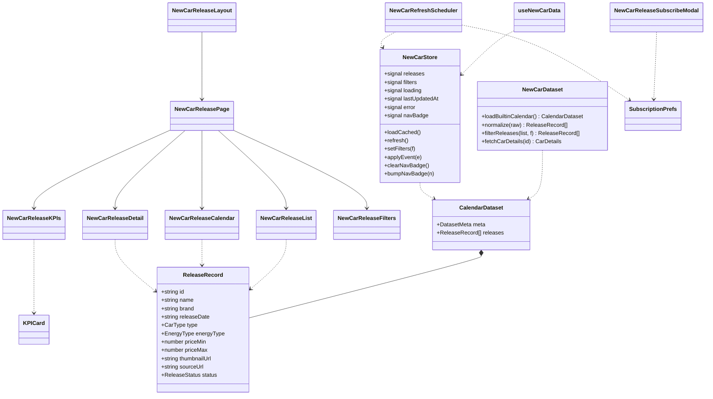
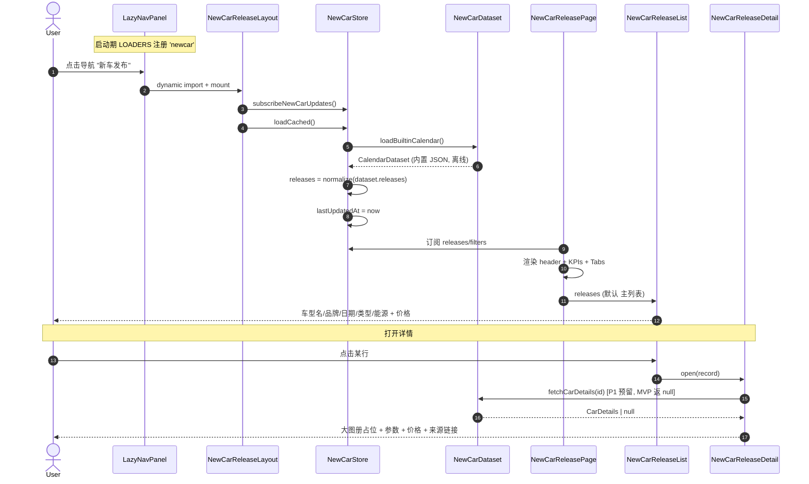
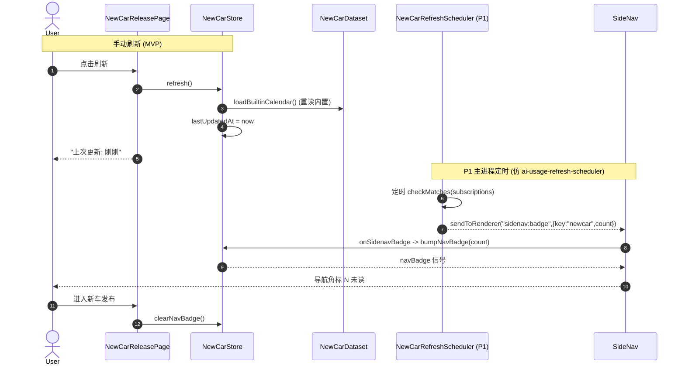
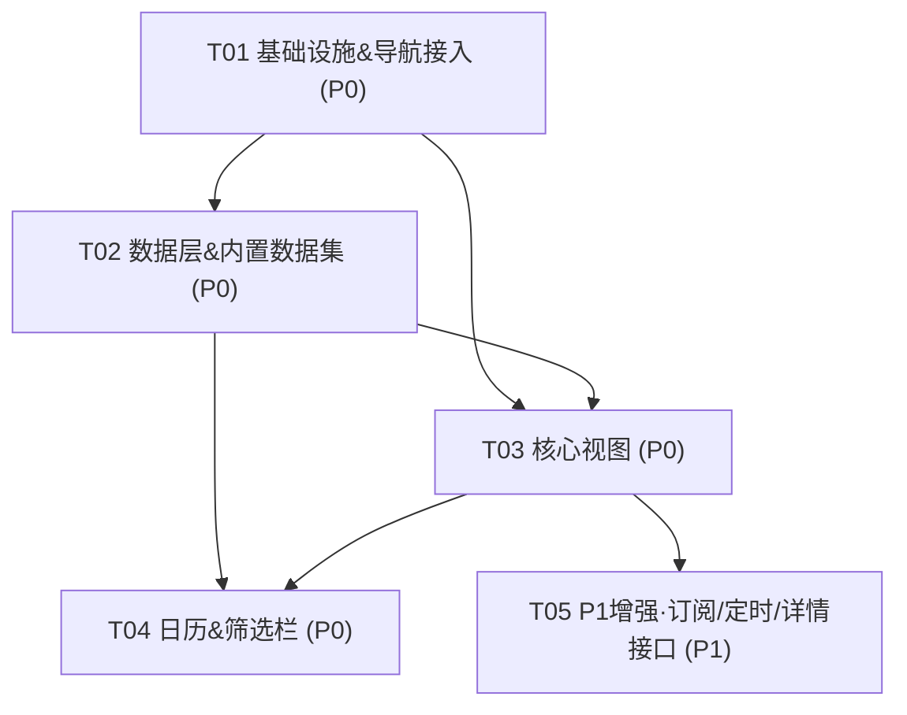

# 「新车发布」模块 · 系统架构设计 + 任务分解

> **作者**：高见远（Architect / Bob）
> **输入**：PM 许清楚《产品需求文档》+ 用户锁定决策 + 宿主项目 `AppUpdateChecker-Electron`（Pulse）现状 grounding
> **范围**：AppUpdateChecker-Electron 的「新车发布」模块（独立 lazy nav panel，与"软件更新 / AI coding plan 用量"平级）
> **状态**：MVP（P0）设计定稿 + P1 预留接口位
> **约定**：不写最终业务代码，仅给类型 / 接口 / 伪代码 / 任务分解；复用现有组件与设计令牌，不引入厚重依赖

---

## Part A：系统设计

### 1. 实现方案（Implementation Approach）

#### 1.1 技术难点与决策

| 难点 | 决策 | 理由 |
|---|---|---|
| 数据源 | **MVP = 内置维护型数据集**（随包 JSON），不上网即可浏览 | 用户拍板；零 API 资质负担、离线可用、首屏零延迟 |
| 框架 | **沿用 Preact + preact/hooks + esbuild**，不引入新框架 | 宿主已是 Preact（非 React）；与 `ai-usage` 完全同栈 |
| 状态管理 | **`@preact/signals`**（已装 `^1.3.0`） | 与 `ai-usage-store.js` 同构，信号驱动、跨组件共享 |
| 离线能力 | 内置 JSON 经 esbuild 打进 bundle（esbuild 原生支持 `.json` import，无需额外 loader） | 天然离线；`lastUpdatedAt` 等元数据落 `localStorage` |
| 详情增强 | **MVP 不接 API**，`fetchCarDetails(id)` 仅预留签名 + 返回 `null` 占位 | P1 再接汽车之家/懂车帝开放平台，失败不影响主列表 |
| 刷新 | MVP = 手动重读内置数据（更新"上次更新"时间戳）；P1 = 主进程定时 scheduler | 仿 `ai-usage-refresh-scheduler.js` |
| 提醒角标 | 复用 `sendToRenderer("sidenav:badge", { key: "newcar", count })` | 与 `ai-usage` 角标机制完全一致 |

#### 1.2 架构模式

- **Lazy Nav Panel + Layout 容器**：仿 `AIUsageLayout.jsx` —— 独立 chunk，切到该 nav 时才 `import()`，挂载即 `subscribe + loadCached`。
- **Store（信号）+ 纯函数数据层**：数据层（`src/newcar/`）是纯函数 + 内置 JSON，无 Preact 依赖；Renderer Store（`src/renderer/store/newcar-store.js`）持有信号，组件只读信号。
- **展示/容器分离**：`NewCarReleasePage`（容器：header + KPI + Tabs）下挂 `List / Calendar / Detail / Filters / KPIs`（纯展示组件，props 驱动）。
- **模块位置对齐**：`src/newcar/` 对齐 `src/ai-usage/`（数据 + normalize + 预留 fetch）；UI 组件放 `src/renderer/components/NewCarRelease*.jsx` 对齐 `AIUsage*.jsx`；Store 放 `src/renderer/store/newcar-store.js` 对齐 `ai-usage-store.js`。

---

### 2. 文件列表（File List）

> 标注：`[新]` 新建 · `[改]` 修改现有文件 · `[复]` 复用现有文件（不新建）

#### 数据层 `src/newcar/`（对齐 `src/ai-usage/`）
| 路径 | 类型 | 说明 |
|---|---|---|
| `src/newcar/types.js` `[新]` | JS + JSDoc/伪 TS | 发布记录类型、枚举（`CarType`/`EnergyType`/`ReleaseStatus`）、`CarDetails`、`DatasetMeta`、`CalendarDataset`、`SubscriptionPrefs`、`FilterState`、`Kpis` |
| `src/newcar/newcar-2026.json` `[新]` | JSON | 内置 2026 发布日历数据集（MVP ≥30 条样例，覆盖各品牌/能源/状态） |
| `src/newcar/dataset.js` `[新]` | JS | `loadBuiltinCalendar()` 读内置 JSON；`normalize(raw)` 清洗；`fetchCarDetails(id)` **P1 预留签名**（MVP 返 `null`）；`filterReleases()` |
| `src/newcar/aggregate.js` `[新]` | JS | `groupByMonth()` / `groupByDate()` / `computeKpis()`（本月/本周/今年累计/即将发布） |

#### Renderer 状态 `src/renderer/store/`
| 路径 | 类型 | 说明 |
|---|---|---|
| `src/renderer/store/newcar-store.js` `[新]` | JS + signals | 信号：`releases / filters / loading / lastUpdatedAt / error / navBadge / selectedDate`；方法：`loadCached / refresh / setFilters / applyEvent / clearNavBadge / bumpNavBadge`；导出 `useNewCarData()` hook |

#### Renderer 组件 `src/renderer/components/`（对齐 `AIUsage*.jsx`）
| 路径 | 类型 | 说明 |
|---|---|---|
| `NewCarReleaseLayout.jsx` `[新]` | lazy 容器 | 仿 `AIUsageLayout.jsx`：`useEffect` 内 `subscribeNewCarUpdates() + loadCached()` |
| `NewCarReleasePage.jsx` `[新]` | 容器页 | header（标题/副标题/刷新/"上次更新：X 前"/提醒铃铛）+ KPI 概览条 + 三视图 Tabs |
| `NewCarReleaseKPIs.jsx` `[新]` | 展示 | 4 张 `KPICard`（本月/本周/今年累计/即将发布），可选 sparkline |
| `NewCarReleaseList.jsx` `[新]` | 展示 | P0 主列表：行高≥44px、缩略图占位 + 车型名 + 品牌/类型/能源 Badge + 发售日期(tabular-nums) + 价格区间 |
| `NewCarReleaseDetail.jsx` `[新]` | 展示 | 详情：大图册占位网格 + 标题/品牌/日期 + 参数表 + 价格区间条 + 来源链接；顶部 Ghost 返回 |
| `NewCarReleaseCalendar.jsx` `[新]` | 展示 | P0 时间轴/日历：月历网格（圆点=当日发布数）下钻 + 纵向时间轴按月分区 |
| `NewCarReleaseFilters.jsx` `[新]` | 展示 | P0 筛选栏：品牌下拉 + 价格滑块 + 能源 chips（驱动 `filters` 信号） |

#### P1 增强（可选）
| 路径 | 类型 | 说明 |
|---|---|---|
| `src/main/newcar-refresh-scheduler.js` `[新]` | main 进程 | 仿 `ai-usage-refresh-scheduler.js`：定时 `checkMatches(subscriptions)` → `sendToRenderer("sidenav:badge", {key:"newcar",count})` |
| `src/renderer/components/NewCarReleaseSubscribeModal.jsx` `[新]` | 展示 | 订阅/提醒设置（品牌/级别/能源），写 `localStorage` |
| `src/newcar/fetch-details.js` `[新]` | JS | `fetchCarDetails(id)` 真实骨架（P1 接 API，`try/catch` 失败返 `null`，不阻断主列表） |

#### 修改现有文件
| 路径 | 修改点 |
|---|---|
| `src/renderer/components/LazyNavPanel.jsx` `[改]` | 在 `LOADERS` 增加 `'newcar': () => import('../newcar/NewCarReleaseLayout.jsx')...`（注：组件实际在 `components/`，loader 指向 `./NewCarReleaseLayout.jsx`） |
| `src/renderer/components/SideNav.jsx` `[改]` | `NAV_ITEMS` 增加 `{ key:'newcar', label:'新车发布', tooltip:'2026 全年上市/发布日历' }`；引入 `newCarNavBadge` 并加入 `navBadges['newcar']` |
| `styles.css` `[改]` | 末尾追加 `/* New Car Release */` 段，仅用现有令牌定义 `.newcar-*` 类（不新增颜色令牌） |

#### 复用（不新建）
- `src/renderer/components/KPICard.jsx` `[复]` —— KPI 卡
- `src/renderer/components/UsageSparkline.jsx` `[复]` —— 发布趋势迷你图（P1 `computeKpis` 喂 `history.days` 式序列）
- `src/renderer/components/icons.jsx` `[复]` —— `IconBell` 提醒铃铛；可加 `IconCar`（纯 SVG，无新依赖）
- `src/main/bootstrap/schedulers.js` `[复]` —— P1 在此 `startNewCarScheduler(deps)` 接线
- `sendToRenderer("sidenav:badge", …)` 机制 `[复]`

---

### 3. 数据结构与接口（Data Structures & Interfaces）

#### 3.1 发布记录类型（伪 TS，落地为 JSDoc + `@typedef`）

```ts
// src/newcar/types.js
type CarType       = '轿车' | 'SUV' | 'MPV' | '跑车' | '皮卡' | '其他';
type EnergyType    = '燃油' | '混动' | '纯电' | '增程';
type ReleaseStatus = '预售' | '上市' | '首发' | '改款';

interface ReleaseRecord {
  id: string;            // 稳定唯一 id, 如 "2026-byd-han-ev-001"
  name: string;          // 车型名, 如 "比亚迪 汉 EV 2026"
  brand: string;         // 品牌, 如 "比亚迪"
  releaseDate: string;   // YYYY-MM-DD (所在日, 以北京时间为准)
  type: CarType;
  energyType: EnergyType;
  priceMin: number | null;  // 万元; 未知为 null
  priceMax: number | null;  // 万元; 未知为 null
  thumbnailUrl: string | null; // MVP 多为 null (占位)
  sourceUrl: string | null;    // 来源链接
  status: ReleaseStatus;       // 预售/上市/首发/改款
}

interface DatasetMeta { year: number; version: string; updatedAt: string; source: string; }
interface CalendarDataset { meta: DatasetMeta; releases: ReleaseRecord[]; }

// P1 详情增强 (fetchCarDetails 返回)
interface CarDetails {
  id: string;
  specs: Record<string, string>;  // 参数名 -> 值
  gallery: string[];              // 图册 URL 列表
  priceRange?: { min: number; max: number };
  fetchedAt: number;              // epoch ms
}

// 筛选状态 (驱动主列表/日历)
interface FilterState {
  brands?: string[];        // 品牌白名单, 空=全部
  energyTypes?: EnergyType[];// 能源白名单
  priceMin?: number | null; // 万元
  priceMax?: number | null;
  status?: ReleaseStatus[]; // 状态白名单
  date?: string | null;     // 某天 (YYYY-MM-DD), 用于"某天有哪些发布"
}

// KPI 概览
interface Kpis {
  thisMonth: number;   // 本月发布数
  thisWeek: number;    // 本周发布数
  ytd: number;         // 今年累计 (至今天)
  upcoming: number;    // 即将发布 (releaseDate > 今天)
}
```

#### 3.2 内置数据集 JSON Schema

```jsonc
// src/newcar/newcar-2026.json
{
  "meta": {
    "year": 2026,
    "version": "2026.1",
    "updatedAt": "2026-01-15",
    "source": "内置维护型数据集 (MVP)"
  },
  "releases": [
    {
      "id": "2026-byd-han-ev-001",
      "name": "比亚迪 汉 EV 2026",
      "brand": "比亚迪",
      "releaseDate": "2026-03-12",
      "type": "轿车",
      "energyType": "纯电",
      "priceMin": 18.98,
      "priceMax": 26.98,
      "thumbnailUrl": null,
      "sourceUrl": "https://www.example.com/byd/han-ev-2026",
      "status": "上市"
    }
    // … MVP ≥30 条, 覆盖 燃油/混动/纯电/增程 × 轿车/SUV/MPV × 预售/上市/首发/改款
  ]
}
```

> **字段约定**：JSON 与 JS 模型统一 **camelCase**（与 `history-series.js` 的 `date` 同风）；价格单位 **万元**（CNY 10k），未知用 `null`；`releaseDate` 视为"所在日"，不做时区换算。

#### 3.3 组件 Props 约定

```ts
// 容器
NewCarReleaseLayout(): void                       // 无 props, 仿 AIUsageLayout
NewCarReleasePage(): void                         // 读 store 信号

// 展示组件 (纯 props, 无副作用)
NewCarReleaseKPIs({ kpis: Kpis, trend?: number[] }): void
NewCarReleaseList({ releases: ReleaseRecord[], onOpen: (r: ReleaseRecord) => void }): void
NewCarReleaseCalendar({
  releases: ReleaseRecord[],
  onSelectDate: (date: string) => void,
  onOpen: (r: ReleaseRecord) => void,
}): void
NewCarReleaseDetail({ record: ReleaseRecord | null, onBack: () => void }): void
NewCarReleaseFilters({
  filters: FilterState,
  brands: string[],            // 可选品牌全集 (从 releases 派生)
  onChange: (next: FilterState) => void,
}): void
```

#### 3.4 `useNewCarData()` Hook 接口（store 导出）

```ts
// src/renderer/store/newcar-store.js
function useNewCarData(): {
  releases: ReleaseRecord[];        // 全量 (已 normalize)
  loading: boolean;
  error: string | null;
  lastUpdatedAt: number | null;     // epoch ms, 驱动"上次更新：X 前"
  filters: FilterState;
  filtered: ReleaseRecord[];        // 应用 filters 后的结果
  kpis: Kpis;                       // 基于全量计算
  byMonth: Map<string, ReleaseRecord[]>;   // "2026-03" -> []
  byDate: Map<string, ReleaseRecord[]>;    // "2026-03-12" -> []
  navBadge: number;                 // 未读角标
  refresh: () => Promise<void>;     // 手动刷新 (MVP 重读内置)
  setFilters: (next: FilterState) => void;
  setSelectedDate: (date: string | null) => void;
  clearNavBadge: () => void;
};
```

#### 3.5 `fetchCarDetails(id)` 预留签名（P1）

```ts
// src/newcar/dataset.js (MVP) / src/newcar/fetch-details.js (P1)
/**
 * P1 详情增强: 接入汽车数据 API 补全参数/价格/图册.
 * MVP: 直接返 null (不阻断主列表); P1: 真实请求 + try/catch 失败返 null.
 */
async function fetchCarDetails(id: string): Promise<CarDetails | null>;
```

#### 3.6 类图（Mermaid）

> 完整版见 `docs/newcar/class-diagram.mermaid`



---

### 4. 程序调用流程（Program Call Flow）

#### 4.1 内置数据加载 → 渲染主列表/日历/详情（时序图）

> 完整版见 `docs/newcar/sequence-diagram.mermaid`



#### 4.2 手动刷新 + 主进程定时角标（时序）



---

### 5. 待明确事项（Anything UNCLEAR）

1. **数据集维护方**：谁来填充 2026 真实发布日历？手工录入 vs 半自动聚合？MVP 先放 **≥30 条覆盖各维度样例**，后续替换为真实数据（仍走内置 JSON 形态）。
2. **API key 管理时机**：P1 详情增强的 key 放哪？建议复用设置页「数据源」tab（对齐 AI 配置的 `api_key` 模式），不在 MVP 处理。
3. **导航是否绑 tray 菜单 prefs 段**：`NAV_TO_PREFS_SEGMENT` 是否加 `'newcar' → 'new_car'`？**MVP 默认不绑**（常驻可见）；若需可隐藏，再在 main config 加段。
4. **订阅持久化落盘**：MVP 用 `localStorage`（`newcar:subscriptions`）；是否要主进程 `state.json` 统一？建议 MVP 先 localStorage。
5. **价格单位确认**：按 **万元** 设计，未知 `null`；如需"元"请告知（仅改展示 formatter）。
6. **缩略图占位**：MVP 无图，`thumbnailUrl` 多为 `null`，用"品牌首字 + 渐变占位"；P1 接 API 后填真实 URL。
7. **日期语义**：`releaseDate` 视为"所在日"，以本地（北京）时间为准，不做时区换算；如需 UTC 请确认。
8. **esbuild JSON 内联**：内置 JSON 会被打进 bundle（离线天然），但**无法运行时热更**；若日后要"在线更新数据集"，需改走 main IPC 读 app-bundle 外置 JSON（P2 考虑）。

---

## Part B：任务分解（Task Decomposition）

### 6. 依赖包列表（Required Packages）

**MVP 新增依赖：0（零新增）**

| 包 | 版本 | 用途 | 状态 |
|---|---|---|---|
| `preact` | `^10.22.0` | UI runtime | 已存在，复用 |
| `@preact/signals` | `^1.3.0` | 状态信号 | 已存在，复用 |
| `esbuild` | `^0.28.1` | 构建（原生支持 `.json` import） | 已存在，复用 |
| 日期处理 | — | **不引入** `date-fns`，手写 `addDays/buildSeries` 式工具（对齐 `history-series.js`） | 0 新增 |
| 图标 | — | 复用 `icons.jsx`（`IconBell`），如需汽车图标加纯 SVG（无依赖） | 0 新增 |

> 结论：MVP **基本零新增依赖**，仅可能手写 1 个日期工具函数；严格不引入厚重依赖。

### 7. 任务列表（有序、含依赖）

> 遵循架构约束：**≤5 个任务、每任务 ≥3 文件、T01 为基础设施**。每个任务内部可按 2 文件小批实现。MVP 聚焦 P0（T01–T04），P1 标 `[可选]`。

| TaskID | 任务名 | 源文件（Source Files） | 依赖 | 优先级 | 备注 |
|---|---|---|---|---|---|
| **T01** | 项目基础设施 & 导航接入 | `src/renderer/components/LazyNavPanel.jsx`[改] · `src/renderer/components/SideNav.jsx`[改] · `src/renderer/store/newcar-store.js`[新] · `src/newcar/types.js`[新] | 无 | P0 | 注册 nav loader + 角标信号 + store 骨架 + 类型 |
| **T02** | 数据层 & 内置数据集（MVP 主源） | `src/newcar/newcar-2026.json`[新] · `src/newcar/dataset.js`[新] · `src/newcar/aggregate.js`[新] | T01 | P0 | 内置 JSON + normalize + filter/group/kpi |
| **T03** | 核心视图（Layout/Page/List/Detail/KPI） | `NewCarReleaseLayout.jsx`[新] · `NewCarReleasePage.jsx`[新] · `NewCarReleaseKPIs.jsx`[新] · `NewCarReleaseList.jsx`[新] · `NewCarReleaseDetail.jsx`[新] | T01, T02 | P0 | 主列表 + 详情 + KPI 概览 + Tabs 容器 |
| **T04** | 日历/时间轴视图 & 筛选栏 | `NewCarReleaseCalendar.jsx`[新] · `NewCarReleaseFilters.jsx`[新] · `styles.css`[改] | T01, T02, T03 | P0 | 三视图补齐 + 筛选栏 + 组件样式段 |
| **T05** | P1 增强（订阅提醒 + 主进程定时 + 详情接口位）`[可选]` | `src/main/newcar-refresh-scheduler.js`[新] · `src/renderer/components/NewCarReleaseSubscribeModal.jsx`[新] · `src/newcar/fetch-details.js`[新] | T03 | P1 | 角标推送 + 订阅设置 + `fetchCarDetails` 真实骨架 |

### 8. 共享知识（Shared Knowledge / Cross-cutting）

- **命名规范**：组件 PascalCase（`NewCarReleaseXxx`）；CSS 类 kebab-case 且前缀 `newcar-`；数据字段/JS 模型 camelCase；JSON 与 JS 同形。
- **设计令牌（严禁裸 hex，走 CSS 变量 / oklch）**：
  - 强调色：`--accent-primary`（header、链接、胶囊按钮）；可选 `--accent-versions` 作"版本检查兄弟模块"视觉呼应。
  - 文字：`--text-primary` / `--text-secondary` / `--text-tertiary`。
  - 表面/背景：`--surface` / `--bg-primary` / `--bg-secondary`。
  - 边框：`--border`（列表分隔线）。
  - 圆角：`--radius-md`（卡片/按钮）、`--radius-pill`（Badge/胶囊）。
  - 间距：`--space-*`（行内距 ≥ `--space-3`，列表行高 ≥44px）。
  - 字号：`--font-size-*`；价格/日期用 `tabular-nums`。
  - **状态色**（映射 `ReleaseStatus`）：`预售`→`--accent-primary`；`上市`→`--color-success`；`首发`→`--color-info`(`--blue-500`)；`改款`→`--color-warning`。能源 Badge 用中性 `--text-secondary` + `--border` 胶囊。
- **与 `ai-usage` 对齐点**：
  - Layout 容器：`subscribe + loadCached` 挂载模式（仿 `AIUsageLayout`）。
  - 状态：`signal` store + `applyEvent/clearNavBadge/bumpNavBadge`（仿 `ai-usage-store`）。
  - 角标：`sendToRenderer("sidenav:badge", { key: "newcar", count })`（仿 `ai-usage-refresh-scheduler`）。
  - 复用组件：`KPICard`、`UsageSparkline`（P1 趋势迷你图喂 `computeKpis` 序列）、`IconBell`。
  - 导航注册：`LazyNavPanel.LOADERS` + `SideNav.NAV_ITEMS`（仿 `ai-usage`）。
- **数据文件格式约定**：`{ meta: DatasetMeta, releases: ReleaseRecord[] }`；`meta.version` 用于缓存失效；`releases[]` 每条含 `id`（稳定唯一，去重键）。
- **离线缓存策略**：
  - 日历数据集：esbuild 内联进 bundle → 天然离线，零网络。
  - 元数据缓存：`localStorage["newcar:lastUpdatedAt"]`（epoch ms，驱动"上次更新：X 前"）。
  - 用户态：`localStorage["newcar:subscriptions"]`（P1 订阅）、`localStorage["newcar:favorites"]`（P2 收藏）。
  - 可选镜像：`localStorage["newcar:cache:v1"]` = 序列化 `releases`，用于极速首屏 + P1 合并远程增量（MVP 可不实现，仅预留 key）。
- **可达性**：列表用 `<ul>/<li>`、按钮用 `<button>`；状态除颜色外辅以文字/图标；`prefers-reduced-motion` 关闭非必要过渡；焦点环 `var(--focus-ring)`。

### 9. 任务依赖图（Task Dependency Graph）



---

## 附：关键伪代码（供工程师落地参考，非最终业务代码）

### 9.1 `newcar-store.js`（信号 + 方法骨架）

```js
import { signal } from "@preact/signals";
import { loadBuiltinCalendar, normalize, filterReleases } from "../../newcar/dataset.js";
import { groupByMonth, groupByDate, computeKpis } from "../../newcar/aggregate.js";

export const newCarReleases   = signal([]);          // ReleaseRecord[]
export const newCarFilters    = signal({});           // FilterState
export const newCarLoading    = signal(false);
export const newCarLastUpdate = signal(null);         // epoch ms
export const newCarError      = signal(null);
export const newCarNavBadge   = signal(0);
export const newCarSelectedDate = signal(null);

let _badgeDismissed = false;
let _subscribed = false;

export function loadCached() {
  try {
    const ds = loadBuiltinCalendar();                // 内置 JSON, 离线
    newCarReleases.value = normalize(ds.releases);
    newCarLastUpdate.value = Date.now();
  } catch (e) {
    newCarError.value = e?.message || "load_failed";
  }
}

export function refresh() {
  // MVP: 重读内置 (未来 P1 可改为 main IPC 拉取 + 合并远程增量)
  loadCached();
  return Promise.resolve();
}

export function setFilters(next) { newCarFilters.value = next; }
export function setSelectedDate(d) { newCarSelectedDate.value = d; }

export function clearNavBadge() { _badgeDismissed = true; newCarNavBadge.value = 0; }
export function bumpNavBadge(n = 1) { _badgeDismissed = false; newCarNavBadge.value += Math.max(1, n|0); }

export function applyEvent(e) { /* P1: main push 新匹配 -> bumpNavBadge */ }

export function subscribeNewCarUpdates() {
  if (_subscribed) return; _subscribed = true;
  // api.onSidenavBadge(payload => payload?.key === "newcar" && bumpNavBadge(payload.count))
}

// 派生 (hook 内 useMemo)
export function useNewCarData() {
  // 订阅各 signal, 计算 filtered / kpis / byMonth / byDate
  // 返回 §3.4 所述结构
}
```

### 9.2 `dataset.js` / `aggregate.js`（纯函数骨架）

```js
import builtin from "./newcar-2026.json";            // esbuild 原生 JSON import

export function loadBuiltinCalendar() { return builtin; }

export function normalize(raw = []) {
  return (Array.isArray(raw) ? raw : []).filter(r => r && r.id && /^\d{4}-\d{2}-\d{2}$/.test(r.releaseDate));
}

export function filterReleases(list, f = {}) {
  return list.filter(r =>
    (!f.brands?.length       || f.brands.includes(r.brand)) &&
    (!f.energyTypes?.length  || f.energyTypes.includes(r.energyType)) &&
    (!f.status?.length       || f.status.includes(r.status)) &&
    (f.date ? r.releaseDate === f.date : true) &&
    (f.priceMin == null || (r.priceMax != null && r.priceMax >= f.priceMin)) &&
    (f.priceMax == null || (r.priceMin != null && r.priceMin <= f.priceMax))
  );
}

// aggregate.js
export function groupByMonth(list) { /* "2026-03" -> [] */ }
export function groupByDate(list)  { /* "2026-03-12" -> [] */ }
export function computeKpis(list, now = new Date()) {
  // thisMonth / thisWeek / ytd / upcoming
}
```

### 9.3 P1 预留：`fetchCarDetails(id)`

```js
// src/newcar/dataset.js (MVP)
export async function fetchCarDetails(/* id */) { return null; }  // 占位, 不阻断主列表

// src/newcar/fetch-details.js (P1 真实骨架)
export async function fetchCarDetails(id) {
  try {
    // const r = await api.newCarFetchDetails({ id });
    // return r?.ok ? r.details : null;
    return null;
  } catch { return null; }   // 失败静默降级
}
```
